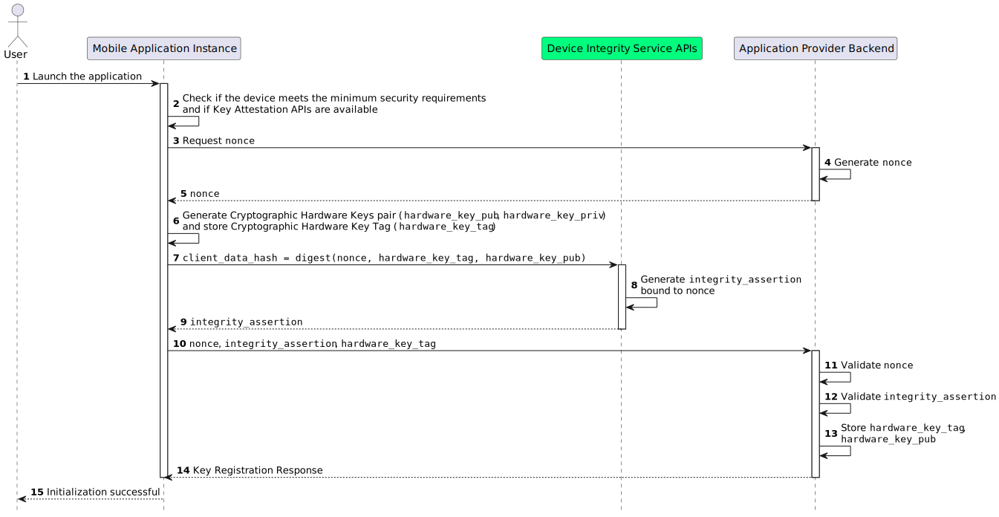

.. _mobile-instance-app-initialization-and-registration.rst:

Mobile Application Instance Initialization and Registration
~~~~~~~~~~~~~~~~~~~~~~~~~~~~~~~~~~~~~~~~~~~~~~~~~~~~~~~~~~~~~~

Since the registration flows are analogous for a Wallet or Relying Party Instance, these components are henceforth called Mobile Application Instance. Similarly, the Application Provider backend fulfills the roles of the Wallet Provier and Relying Party backend depending on the registration process.   

uUktUUe6FcDofWLf2N3M3fti2QM0IkLZej-rP8vW3qLGqyaQWfv8k02zTRPFFJ2P5AsS8TAFP2Frv8Jt3bqzID-FigqJQWhhWM91B0EUq7POTJGDpN4tS9zTY0MqDYrs7Rc6j9uZbahvcDWVo54Sy4CaRfUYaJTrMVvJqy9mxZmRtiLp4Dz43Aqry15Z_HCZGRuhXe0smfNMxOG-7kdy65AbzIjuZaPxqlfwt0UBZ_zpXg_Oh7m5cspm9oCARy1vPmZUG6qROhbQTCi9rlerMj9UptiTZ9KQpcd8l0cj1m7E3rHhsBlAfzn8_1XcalvTzbgHTxuOzlJELmLMyikj_lailcDdwumldIypLiCMl8ToPPTNkdVhfIwVNRdKUseiIopc-GS7xvZKypTOq-epp2R3nxjPEd0oXfWFgLCtvEhKTxy1

    Mobile Application Instance Initialization Flow

**Step 1**: The User starts the Mobile Application Instance mobile app for the first time.

**Step 2**: The Mobile Application Instance:

  * Checks whether the device meets the minimum security requirements.
  * Checks if the Key Attestation API is available.

.. note::

    **Federation Check**: The Mobile Application Instance needs to check if the Application Provider is part of the Federation, obtaining its protocol-specific Metadata. Non-normative examples of a response from the :ref:`Federation endpoint` with the **Entity Configuration** and the **Metadata** of the Application Provider are presented within the :ref:`Wallet Provider Entity Configuration` and :ref:`Entity Configuration of Relying Parties` sections.

**Steps 3-5 (Challende Retrieval)**: The Mobile Application Instance requests a one-time ``challenge`` from the :ref:`Nonce endpoint` of the Application Provider Backend. This ``challenge`` MUST be unpredictable to serve as the main defense against replay attacks. 

Upon a successful request, the Application Provider Backend generates and returns the ``challenge`` value to the Mobile Application Instance. The backend MUST ensure that it is single-use and valid only within a specific time frame. 

**Step 6**: The Mobile Application Instance, through the operating system, creates a pair of Cryptographic Hardware Keys and stores the corresponding Cryptographic Hardware Key Tag in local storage once the following requirements are met:

  1. It MUST ensure that Cryptographic Hardware Keys do not already exist. If they do exist and the Wallet is in the initialization phase, they MUST be deleted.
  2. It MUST generate a pair of asymmetric Elliptic Curve keys (hardware_key_pub, hardware_key_priv) via a local WSCD.
  3. It SHOULD obtain a unique identifier Cryptographic Hardware Key Tag (hardware_key_tag) for the generated Cryptographic Hardware Keys from the operating system. If the operating system permits specifying a tag during the creation of keys, then a random string for the hardware_key_tag MUST be selected. This random value MUST be collision-resistant and unpredictable to ensure security. To achieve this, consider using a cryptographic hash function or a secure random number generator provided by the operating system or a reputable cryptographic library.
  4. If the previous points are satisfied, it MUST store the hardware_key_tag in local storage.

.. note::

  **WSCD**: The Mobile Application Instance MAY use a local WSCD for cryptographic operations, including key generation, secure storage, and cryptographic processing,  on devices that support this feature. On Android devices, Strongbox is RECOMMENDED; Trusted Execution Environment (TEE) MAY be used only when Strongbox is unavailable. For iOS devices, Secure Elements (SE) MUST be used. Given that each OEM offers a distinct SDK for accessing the local WSCD, the discussion hereafter will address this topic in a general context.

  If the WSCD fails during any of these operations, for example due to hardware limitations, it will raise an error response to the Mobile Application Instance. The Mobile Application Instance MUST handle these errors accordingly to ensure secure operation. Details on error handling are left to the Mobile Application Instance implementation.

**Step 7**: The Mobile Application Instance uses the Key Attestation API, providing the "challenge" and the Cryptographic Hardware Key Tag to acquire the Key Attestation.

.. note::

  **Key Attestation API**: In this section, the Key Attestation API is assumed to be provided by device manufacturer. This service allows the verification of a key being securely stored within the device's hardware through a signed object. Additionally, it offers verifiable proof that a specific Mobile Application Instance is authentic, unaltered, and in its original state using a specialized signed document made for this purpose.

  The service also incorporates details in the signed object, such as the device type, model, app version, operating system version, bootloader status, and other relevant information to assess whether the device has been compromised. For Android, the Key Attestation APIS is represented by *Key Attestation*, a feature supported by *StrongBox Keymaster*, which is a physical HSM installed directly on the motherboard, and the *TEE* (Trusted Execution Environment), a secure area of the main processor. *Key Attestation* aims to provide a way to strongly determine if a key pair is hardware-backed, what the properties of the key are, and what constraints are applied to its usage. Developers can leverage its functionality through the *Play Integrity API*. For Apple devices, the Key Attestation APIS are represented by *DeviceCheck*, which provides a framework and server interface to manage device-specific data securely. *DeviceCheck* is used in combination with the *Secure Enclave*, a dedicated HSM integrated into Apple's SoCs. *DeviceCheck* can be used to attest to the integrity of the device, apps, and/or encryption keys generated on the device, ensuring they were created in a secure environment like *Secure Enclave*. Developers can leverage *DeviceCheck* functionality by using the framework itself.
  These services, specifically developed by the manufacturer, are integrated within the Android or iOS SDKs, eliminating the need for a predefined endpoint to access them. Additionally, as they are specifically developed for mobile architecture, they do not need to be registered as Federation Entities through national registration systems.
  *Secure Enclave* has been available on Apple devices since the iPhone 5s (2013).
  For Android devices, the inclusion of **Strongbox Keymaster** may vary by manufacturer, who decides whether to include it or not.

If any errors occur in any Key Attestation APIS process, such as device integrity verification, for example, due to unavailable Key Attestation APIs, an internal error, or an invalid challenge in the integrity request, the Key Attestation APIS raise an error response. The Mobile Application Instance MUST process these errors accordingly. Details on error handling are left to the Mobile Application Instance implementation.
 

**Step 8**: The Key Attestation API performs the following actions:

* Creates a Key Attestation that is linked with the provided "challenge" and the public key of the Wallet Hardware.
* Incorporates information pertaining to the device's security.
* Uses an OEM private key to sign the Key Attestation, therefore verifiable with the related OEM certificate, confirming that the Cryptographic Hardware Keys are securely managed by the operating system.

**Step 9 (Mobile Application Instance Registration Request)**: The Mobile Application Instance sends a request to the :ref:`Mobile Application Instance Registration Request` of the Application Provider Backend to register the Mobile Application Instance, identified by the Cryptographic Hardware Key public key. 
The request body includes the following claims: the ``challenge``, Key Attestation (``key_attestation``), and Cryptographic Hardware Key Tag (``hardware_key_tag``).

.. note::
  It is not necessary to send the Application Hardware public key because it is already included in the ``key_attestation``.
  As seen in the previous steps, the Key Attestation API creates a Key Attestation linked to the provided "challenge" and the public key of the Wallet Hardware. This process eliminates the need to send the Wallet Hardware public key directly, as it is already included in the key attestation. The ``hardware_key_tag`` serves as a reference or identifier for the corresponding Cryptographic Hardware key stored by the Application Provider. Therefore, the Application Provider can associate the received ``hardware_key_tag`` with the appropriate Cryptographic Hardware key in its storage.

.. warning::
  During the registration phase of the Mobile Application Instance with the Application Provider it is also necessary to associate the Wallet Instace with a specific User, authenticating the User with the Application Provider. The authentication mechanism is at the discretion of the Application Provider and it will not be addressed within these guidelines, as each Application Provider may have its User authentication systems already implemented.

**Steps 10-12 (Mobile Application Instance Registration Response)**: The Application Provider validates the ``challenge`` and ``key_attestation`` signature, therefore:

  1. It MUST verify that the ``challenge`` was generated by Application Provider and has not already been used.
  2. It MUST validate the ``key_attestation`` as defined by the device manufacturers' guidelines.
  3. It MUST verify that the device in use has no security flaws and reflects the minimum security requirements defined by the Application Provider.
  4. If these checks are passed, it MUST register the Mobile Application Instance, keeping the Cryptographic Hardware Key Tag (hardware_key_tag), the Public Hardware Key (hardware_key_pub) and possibly other useful information related to the device.
  5. It SHOULD associate the Mobile Application Instance with a specific User uniquely identified within the Application Provider's systems. This will be useful for the lifecycle of the Mobile Application Instance and for a future revocation.

Upon successful registration of the Mobile Application Instance, the Application Provider responds with a confirmation of success.

**Steps 13-14**: The Mobile Application Instance has been initialized and becomes operational.

.. note:: **Threat Model**: while the registration endpoint does not necessitate to authenticate the client, it is safeguarded through the use of `key_attestation`. Proper validation of this attestation permits the registration of authentic and unaltered app instances. Any other claims submitted will not undergo validation, leading the endpoint to respond with an error. Additionally, the inclusion of a challenge helps prevent replay attacks. The authenticity of both the challenge and the ``hardware_key_tag`` is ensured by the signature found within the ``key_attestation``.

Nonce Request
.............

The request for a challenge MUST be an HTTP GET request sent to the Application Provider’s Nonce Endpoint.

Below is a non-normative example of a Nonce Request.

.. code-block:: http

    GET /challenge HTTP/1.1
    Host: applicationprovider.example.com

Nonce Response
..............
Upon a successful request, the Application Instance Provider MUST return an HTTP response with a 200 OK status code. The response MUST be in `application/json` format, including the ``challenge``.
If any errors occur during the the challenge generation, an error response MUST be returned. Refer to :ref:`Error Handling for Nonce Generation` for details on error codes and descriptions.

Below is a non-normative example of a Nonce Response.

.. code-block:: http

    HTTP/1.1 200 OK
    Content-Type: application/json

    {
      "challenge": "d2JhY2NhbG91cmVqdWFuZGFt"
    }

If any errors occur, the Nonce Endpoint returns an error response. The response uses ``application/json`` as the content type and includes the following parameters:

  - *error*. The error code.
  - *error_description*. Text in human-readable form providing further details to clarify the nature of the error encountered.

.. code-block:: http
    :caption: Non-normative example of a Nonce Error Response
    :name: code_ApplicationProvider_Endpoint_Nonce_Error
    
    HTTP/1.1 500 Internal Server Error
    Content-Type: application/json

    {
        "error": "server_error",
        "error_description": "The server encountered an unexpected error."
    }

The following table lists HTTP Status Codes and related error codes that are supported for the error response:

.. list-table::
    :widths: 30 20 50
    :header-rows: 1

    * - **HTTP Status Code**
      - **Error Code**
      - **Description**
    * - ``500 Internal Server Error``
      - ``server_error``
      - The request cannot be fulfilled because the .well-known Endpoint encountered an internal problem.
    * - ``503 Service Unavailable``
      - ``temporarily_unavailable``
      - The request cannot be fulfilled because the .well-known Endpoint is temporarily unavailable (e.g., due to maintenance or overload).

Mobile Application Instance Registration Request
..................................................

To register a Mobile Application Instance, the request to the Application Provider MUST use the HTTP POST method with ``Content-Type`` set to `application/json`. The request body MUST contain the following claims:

.. _table_http_request_claim:
.. list-table:: 
    :widths: 20 60 20
    :header-rows: 1

    * - **Claim**
      - **Description**
      - **Reference**
    * - **challenge**
      - MUST be set to the value obtained from the Application Provider through the Nonce Endpoint.
      - This specification.
    * - **hardware_key_tag**
      - It MUST be set with the unique identifier of the **Cryptographic Hardware Keys** and encoded in base64url.
      - This specification.
    * - **key_attestation**
      - It MUST be an attestation which guarantees the secure generation, storage and usage of the key pair generated by the Mobile Application Instance. This can be an array containing a certificate chain whose leaf certificate is the Key Attestation obtained from the device **Key Attestation APIs**, signed with the device hardware key.
      - This specification.

Below is a non-normative example of a Mobile Application Instance Registration Request.

.. code-block:: http

    POST /wallet-instances HTTP/1.1
    Host: walletprovider.example.com
    Content-Type: application/json

    {
      "challenge": "d2JhY2NhbG91cmVqdWFuZGFt",
      "key_attestation": "o2NmbXRvYXBwbGUtYXBw... redacted",
      "hardware_key_tag": "WQhyDymFKsP95iFqpzdEDWW4l7aVna2Fn4JCeWHYtbU="
    }

Mobile Application Instance Registration Response
......................................................

If a Mobile Application Instance Registration Request is successfully validated, the Application Provider provides an HTTP Response with status code 204 (No Content).

Below is a non-normative example of  a Mobile Application Instance Registration Response.

.. code-block:: http

    HTTP/1.1 204 No content

If any errors occur during the Mobile Application Instance registration, an error response MUST be returned. Refer to :ref:`Error Handling for Wallet Instance Management` and  for details on error codes and descriptions.

Below is a non-normative example of an error response:

.. code:: http

   HTTP/1.1 403 Forbidden
   Content-Type: application/json
   Cache-Control: no-store

.. code:: json

   {
     "error": "forbidden",
     "error_description": "The provided challenge is invalid, expired, or already used."
   }

