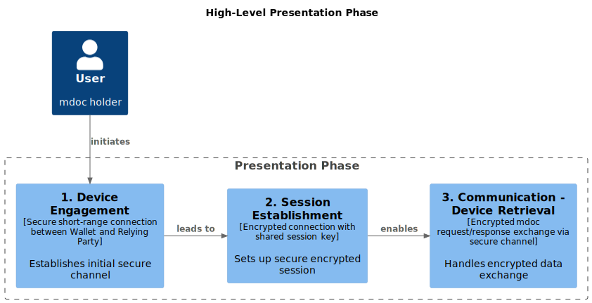

.. include:: ../common/common_definitions.rst

.. _proximity_flow_sec_main:

Proximity Flow
==============

This section describes how a Relying Party Instance requests the presentation of an *mdoc-CBOR* Credential to a Wallet Instance according to the *ISO 18013-5 Specification*. 

The high-level presentation phase is structured into three broad sub-phases as depicted in the following figure: 

ASu76szXzYB7JCx69WCk1Ik_egK-fovQdVjvUw6nRGSDgRuXV0T_5CWt6PrRt7k3Muorhh4HH8Zlbl0umb1EyD1-WwRB2EHIvaNMiKQGZ2AQiSCE-O0OuRiE0HbqjB36qFjOGwKpzuD2IQntmPD30XyzUns0Zgh6QP4ACXV8T-MIa6WO3S_yazFtIzWShs2IFhijeybzosWlJHuyEo2diy1qOlx4_ZWT4tJjsG-Uw5FTRMScDKqNlHbJ5fKFIxcyW61npdADd3tkTVZVtBZJZByw92uoakWI0lusRWnux_LrGa9VIRe1wSAarQmdbbZzgvIaltqyFQ5RQpukW96aVAXTtteChoKVK5i2JXFtbSBhV33AxTXIgNkCjcl2Fm00
    
    High-Level Presentation Flow in proximity
 
The sub-phases are described below:

  1. **Device Engagement**: This subphase begins when the User is prompted to disclose certain attributes from the mdoc(s). The objective of this subphase is to establish a secure communication channel between the Wallet Instance and the Relying Party Instance, so that the mdoc requests and responses can be exchanged during the communication subphase.
  The messages exchanged in this subphase are transmitted through short-range technologies to limit the possibility of interception and eavesdropping.

  2. **Session establishment**: During the session establishment phase, the Relying Party Instance sets up a secure connection. All data transmitted over this connection is encrypted using a session key, which is known to both the Wallet Instance and the Relying Party Instance at this stage.
  The established session MAY be terminated based on the conditions as detailed in [`ISO18013-5`_ #9.1.1.4].

  3. **Communication - Device Retrieval**: The Relying Party Instance encrypts the mdoc request with the appropriate session key and sends it to the Wallet Instance together with its public key in a session establishment message. The mdoc uses the data from the session establishment message to derive the session key and decrypt the mdoc request.
  During the communication subphase, the Relying Party Instance has the option to request information from the Wallet Instance using mdoc requests and responses. The primary mode of communication is the secure channel established during the session setup. The Wallet Instance encrypts the mdoc response using the session key and transmits it to the Verifier App via a session data message. 

Relying Party and Wallet Instances registered in the IT-Wallet ecosystem MUST support at least:

  - *Supervised Device Retrieval flow* where a human Verifier is overseeing the verification process in person, in contrast with *unsupervised flow* where verification might happen through automated systems without human oversight.
  - *Device Engagement* based on QR Code.
  - *RP Instance Authentication* following the mechanisms defined in the `ISO18013-5`_ for the *reader authentication*.
  - *Device Retrieval* mechanism based on Bluetooth Low Energy (BLE) for the communication sub-phase. *Server Retrieval* mechanism MUST NOT be supported.
  - Domestic *Document Type* and *Namespaces* defined in this technical specification in addition to those already defined in the `ISO18013-5`_ for the mDL (see Section :ref:`MDOC-CBOR` for more details).
  - *Wallet Instance validation* through the Wallet Attestation.

The following figure illustrates the low-level flow compliant with ISO 18013-5 for proximity flow.

.. _fig_High-Level-Flow-ITWallet-Presentation-ISO-updated:
9A5iPD3uw60HTa6nXdiXFoXWdSVAc1I-8NlKA3s4BQoLqlmTX0mS5HB9Daf3tXGdFR2lCyljHSj76B6Vu9ExJyGag0HC7L3QKqDYZfwfXuH1u1U_gQhbWWx1qHVgtpv8E5JLDPmVjfkgkYgqndkuWVK-TcDEFrPm7pr1O5UtFl3EIgVA9UzmPtgiLJNM7ifarWxvjBPS6k__-8N1y8hGavmRBeVdXWklwJIfLO9CEOV80s7PlFATWX-44We1GWux9W_87eYTz4c7VweIDiPcReH-jvHrCBMUg9TPSLE7l9ywBowcpY-181v8uEFN9MHohH2uFJ9JVJh9InsKwmMDzYvB33sOIjZs43IFdQ6Qrf74bcjLki6K91wm1jl3bvKUHfkf9dSMGRws45na9JRIk0MXNSWgqs8w4WtROKtfzCbyAFIJT5aeOdyfS3EG8cSwINc1YXQkYNT1zr36SERidw6MIP-dTkIzVZMfuR7uSRLX4tZOzQl1gF6IUvvUl3KLVD3--69Dep33Jv8cy1ZCx8xOjqtz1m00
    
    High-Level Proximity Flow

**Step 1**: The User opens the Wallet Instance initiating the process.

**Step 2**: The User authenticates itself to the Wallet Instance. This can be done by the Wallet Instance or a Wallet Secure Cryptographic Device (WSCD). It is a prerequisite for accessing sensitive data and presenting attributes.

**Step 3**: The User explicitly indicates their intention to present their mdoc Digital Credentials.

**Step 4**: [Optional] If the initial authentication in Step 2 was not done through WSCD, a separate authentication via WSCD might be required before presenting sensitive credentials like the mdoc.

**Step 5**: The Wallet Instance generates a new ephemeral Elliptic Curve key pair for secure communication. The public key (``EDeviceKey.Pub``) will be used for session encryption. This is part of the device engagement process.

**Step 6**: The Wallet Instance presents a QR Code to the Relying Party Instance. This QR code contains the `DeviceEngagement data`, which includes the ``EDeviceKey.Pub`` and information about supported copter suits.

Below an example of a device engagement structure that utilizes QR for device engagement and Bluetooth Low Energy (BLE) for data retrieval.

CBOR data represented in AF Binary format:

.. code-block:: 

  a26776657273696f6e63312e3069646f63756d656e747382a267646f6354797065756f72672e69736f2e31383031332e352e312e6d444c6c6973737565725369676e6564a36a6e616d65537061636573a1716f72672e69736f2e31383031332e352e3185a4686469676573744944006672616e646f6d6b683837393836433230453971656c656d656e744964656e7469666965726b66616d696c795f6e616d656c656c656d656e7456616c756563446f65a4686469676573744944036672616e646f6d6d6842323346363234343631354471656c656d656e744964656e7469666965726a69737375655f646174656c656c656d656e7456616c75656a323031392d31302d3230a4686469676573744944046672616e646f6d6e684337464641333045394142414671656c656d656e744964656e7469666965726b6578706972795f646174656c656c656d656e7456616c75656a323032342d31302d3230a4686469676573744944076672616e646f6d71683236303532413446354235463945363871656c656d656e744964656e7469666965726f646f63756d656e745f6e756d6265726c656c656d656e7456616c756569313233343536373839a4686469676573744944096672616e646f6d77683435393946383142454141324344423241423243453471656c656d656e744964656e7469666965727264726976696e675f70726976696c656765736c656c656d656e7456616c756581a37576656869636c655f63617465676f72795f636f646561416a69737375655f646174656a323031382d30382d30396b6578706972795f646174656a323032342d31302d32306a6973737565724175746884a1613126a16233337845683330383230314546333039343342463541453832433039343342463541453934334246393433424635414535413934334246354145454433413638443934334246354145a1623234a66776657273696f6e63312e306f646967657374416c676f726974686d675348412d32353667646f6354797065756f72672e69736f2e31383031332e352e312e6d444c6c76616c756544696765737473a1716f72672e69736f2e31383031332e352e31ad61306a6837353141444345424661316b683637453533393435373161326b683333393433424635414561336b683245333536313344353561346b684541354333333044353961356b684641453438374141314461366a6837443833453735333361376a6846303534393839333661386a6842363843383746363661396a683042333544364530436231306a684339384131343838316231316a684235374444413934386231326a683635314638313244416d6465766963654b6579496e666fa1696465766963654b6579a4613102622d3101622d32686839363331463941622d33696831464233433344366c76616c6964697479496e666fa3667369676e656474323032302d31302d30315431333a33303a30325a6976616c696446726f6d74323032302d31302d30315431333a33303a30325a6a76616c6964556e74696c74323032312d31302d30315431333a33303a30325a781a68353945363432303544463145373636414546463133434232456c6465766963655369676e6564a26a6e616d65537061636573a06a64657669636541757468a16964657669636553696784a1613105a0f6783d68453939353231413835414437353934334246354145414536383934334246354145323439393433424635414539343342463541453433424635414544a267646f635479706578266f72672e69736f2e31383031332e352e312e69742e57616c6c65744174746573746174696f6e6c6973737565725369676e6564a26a6e616d65537061636573a2716f72672e69736f2e31383031332e352e3181a4686469676573744944006672616e646f6d6b683337393836433230413971656c656d656e744964656e7469666965727169737375696e675f617574686f726974796c656c656d656e7456616c75656941424331323358595a746f72672e69736f2e31383031332e352e312e697484a4686469676573744944006672616e646f6d6b683337393836433230413971656c656d656e744964656e7469666965726977616c6c65745f69646c656c656d656e7456616c75656941424331323358595aa4686469676573744944016672616e646f6d6b683337393836433230413971656c656d656e744964656e7469666965726b77616c6c65745f6c696e6b6c656c656d656e7456616c75656941424331323358595aa4686469676573744944026672616e646f6d6b683337393836433230413971656c656d656e744964656e746966696572637375626c656c656d656e7456616c75656941424331323358595aa4686469676573744944036672616e646f6d6b683337393836433230413971656c656d656e744964656e7469666965726361616c6c656c656d656e7456616c75656941424331323358595a6a6973737565724175746884a1613126a1623333783d68333038323031454633393433424635414530393433424635414538324330393433393433424635414542463541454433413934334246354145363844a1623234a66776657273696f6e63312e306f646967657374416c676f726974686d675348412d32353667646f635479706578266f72672e69736f2e31383031332e352e312e69742e57616c6c65744174746573746174696f6e6c76616c756544696765737473a2746f72672e69736f2e31383031332e352e312e6974a461306a6837353141444345424661316b684535383533393436313861326b683633343533393435373361336b6836374635333934343831716f72672e69736f2e31383031332e352e31a161306a683735314135464542466d6465766963654b6579496e666fa1696465766963654b6579a4613102622d3101622d3269683936334431463941622d33696831464244433344366c76616c6964697479496e666fa3667369676e656474323032302d31302d30315431333a33303a30325a6976616c696446726f6d74323032302d31302d30315431333a33303a30325a6a76

The same content shown above using the diagnostic notation:

.. code-block::

  {
    "0": "1.1", % Version (Updated to 1.1 because Capabilities and OriginInfos are present)
    "1": % Security
    [
      1, % defines the cipher suite , which contains only EC curves
      24(<< % embedded CBOR data item
        {
          "1": 2, % kty:EC2 (Elliptic curves with x and y coordinate pairs)
          "-1": 1, % crv:p256
          "-2":"5A88D182BCE5F42EFA59943F33359D2E8A968FF289D93E5FA444B624343167FE", % x-coordinate
          "-3":"B16E8CF858DDC7690407BA61D4C338237A8CFCF3DE6AA672FC60A557AA32FC67" % y-coordinate
        }
        >>)
    ],
    "2": % DeviceRetrievalMethods (Device engagement using QR code with BLE for retrieval)
    [
      [
        2, % BLE
        1, % Version
        { % BLE options
          "0": false, % no support for mdoc peripheral server mode
          "1": true,  % support for mdoc central client mode
          "11": "45EFEF742B2C4837A9A3B0E1D05A6917" % UUID of mdoc client central mode
        }
      ]
    ],
    "5": % OriginInfos (Required because Capabilities is present)
    [],
    "6": % Capabilities (Defines supported features)
    {
      "2": false, % HandoverSessionEstablishmentSupport (Supports negotiated handover)
      "3": true % ReaderAuthAllSupport (Supports reader authentication)
    }
  }

**Step 7**: The Verifier uses its Relying Party Instance to scan the QR code and retrieve the DeviceEngagement data from the mdoc.

**Step 8**: The Relying Party Instance generates its ephemeral key pair (``EReaderKey. Priv``, ``EReaderKey.Pub``). The private key (``EReaderKey.Priv``) MUST be kept secret, and the public key (``EReaderKey.Pub``) MUST be used in establishing the session.

**Step 9**: The Wallet Instance and Relying Party Instance independently MUST derive the session keys using their private ephemeral key and the other party's public ephemeral key through a key agreement protocol. This ensures session encryption. In this particular step, the Relying Party Instance MUST compute its session key.

**Step 10**: The RP Instance MUST prepares a `SessionEstablishment` message. This message MUST be signed by the Relying Party Instance (mdoc reader authentication as specified in [`ISO18013-5`_ #9.1.1.4]) and encrypted using the session keys derived in the previous step. The `SessionEstablishment` message MUST include the ``EReaderKey.Pub`` and a request for specific attribute(s).

The mdoc request MUST contain a Wallet Attestation (WA) request along with other requests for Digital Credentials, and MUST be encoded in CBOR, as demonstrated in the following non-normative example.

CBOR data in AF Binary format: 

.. code-block::

  a36776657273696f6e63312e306b646f63526571756573747382a16c6974656d7352657175657374d818a267646f6354797065756f72672e69736f2e31383031332e352e312e6d444c6a6e616d65537061636573a1716f72672e69736f2e31383031332e352e31a66b66616d696c795f6e616d65f56f646f63756d656e745f6e756d626572f57264726976696e675f70726976696c65676573f56a69737375655f64617465f56b6578706972795f64617465f568706f727472616974f4a16c6974656d7352657175657374d818a267646f635479706578266f72672e69736f2e31383031332e352e312e69742e57616c6c65744174746573746174696f6e6a6e616d65537061636573a1746f72672e69736f2e31383031332e352e312e6974a463697373f563737562f56b77616c6c65745f6e616d65f56b77616c6c65745f6c696e6bf56a726561646572417574688443a10126a11821590129308201253081cda00302010202012a300a06082a8648ce3d0403023020311e301c06035504030c15536f6d652052656164657220417574686f72697479301e170d3233313132343130323832325a170d3238313132323130323832325a301a3118301606035504030c0f536f6d6520526561646572204b65793059301306072a8648ce3d020106082a8648ce3d03010703420004aa1092fb59e26ddd182cfdbc85f1aa8217a4f0fae6a6a5536b57c5ef7be2fb6d0dfd319839e6c24d087cd26499ec4f87c8c766200ba4c6218c74de50cd1243b1300a06082a8648ce3d0403020347003044022048466e92226e042add073b8cdc43df5a19401e1d95ab226e142947e435af9db30220043af7a8e7d31646a424e02ea0c853ec9c293791f930bf589bee557370a4c97bf6584058a0d421a7e53b7db0412a196fea50ca6d4c8a530a47dd84d88588ab145374bd0ab2a724cf2ed2facf32c7184591c5969efd53f5aba63194105440bc1904e1b9

The above CBOR data is represented in diagnostic notation as follows:

.. code-block::

  {
    "version": "1.0",  % Version

    "docRequests": [
      {
        "itemsRequest": 24(<<  % Embedded CBOR data item
          {
            "docType": "org.iso.18013.5.1.mDL",
            "nameSpaces": {
              "org.iso.18013.5.1": {
                "family_name": true,
                "document_number": true,
                "driving_privileges": true,
                "issue_date": true,
                "expiry_date": true,
                "portrait": false
              }
            }
          }
        >>)
      },
      {
        "itemsRequest": 24(<<  % Embedded CBOR data item
          {
            "docType": "org.iso.18013.5.1.it.WalletAttestation",
            "nameSpaces": {
              "org.iso.18013.5.1.it": {
                "iss": true,
                "sub": true,
                "wallet_name": true,
                "wallet_link": true
              }
            }
          }
        >>)
      }
    ],

    "readerAuth": [
      h'a10126', % COSE_Sign1 authentication header

      {
        33: h'308201253081cda00302010202012a300a06082a8648ce3d0403023020311e301c06035504030c15536f6d652052656164657220417574686f72697479301e170d3233313132343130323832325a170d3238313132323130323832325a301a3118301606035504030c0f536f6d6520526561646572204b65793059301306072a8648ce3d020106082a8648ce3d03010703420004aa1092fb59e26ddd182cfdbc85f1aa8217a4f0fae6a6a5536b57c5ef7be2fb6d0dfd319839e6c24d087cd26499ec4f87c8c766200ba4c6218c74de50cd1243b'
      },

      null, % No additional reader authentication

      h'58a0d421a7e53b7db0412a196fea50ca6d4c8a530a47dd84d88588ab145374bd0ab2a724cf2ed2facf32c7184591c5969efd53f5aba63194105440bc1904e1b9'  % Reader authentication signature
    ]
  }

**Step 11**: The Relying Party Instance MUST transmit the encrypted and signed `SessionEstablishment` message to the Wallet Instance over a secure BLE connection that was established based on the device engagement information.

**Step 12**: The Wallet Instance MUST compute the session key, as described in Step 9.

**Step 13**: Upon receiving the `SessionEstablishment` message, the Wallet Instance MUST decrypt it using the shared session key and MUST verify the Relying Party instance's signature (mdoc reader authentication as specified in [`ISO18013-5`_ #9.1.1.4]) to ensure its authenticity.

**Step 14**: The Wallet Instance MUST decrypt the attribute request and MUST prompt the user for their consent to share the requested attributes. It MUST also display the contents of the Relying Party's registration certificate to ensure transparency about the requested data and its registered purpose.

**Step 15**: The user reviews the request and the Relying Party's registration information and then approves the presentation of the requested attributes. 

**Step 16**: After receiving user approval, the Wallet Instance MUST retrieve the requested mdoc Digital Credentials. It then MUST prepare a `SessionData` message containing these Digital Credentials, and it MUST sign it (mdoc authentication as specified in [`ISO18013-5`_ #9.1.3]). It MUST encrypt it using the established session keys before transmitting it to the Relying Party Instance over the secure BLE channel. The signing ensures device binding and data integrity.

The mdoc response MUST be encoded in CBOR, with its structure outlined in [`ISO18013-5`_ #8.3.2.1.2.2].

CBOR Data:

.. code-block::

  a26776657273696f6e63312e3069646f63756d656e747382a267646f6354797065756f72672e69736f2e31383031332e352e312e6d444c6c6973737565725369676e6564a36a6e616d65537061636573a1716f72672e69736f2e31383031332e352e3185a4686469676573744944006672616e646f6d6d6827383739383643323045392771656c656d656e744964656e7469666965726b66616d696c795f6e616d656c656c656d656e7456616c756563446f65a4686469676573744944036672616e646f6d6f68274232334636323434363135442771656c656d656e744964656e7469666965726a69737375655f646174656c656c656d656e7456616c75656a323031392d31302d3230a4686469676573744944046672616e646f6d706827433746464133304539414241462771656c656d656e744964656e7469666965726b6578706972795f646174656c656c656d656e7456616c75656a323032342d31302d3230a4686469676573744944076672616e646f6d736827323630353241344635423546394536382771656c656d656e744964656e7469666965726f646f63756d656e745f6e756d6265726c656c656d656e7456616c756569313233343536373839a4686469676573744944096672616e646f6d78196827343539394638314245414132434442324142324345342771656c656d656e744964656e7469666965727264726976696e675f70726976696c656765736c656c656d656e7456616c756582a37576656869636c655f63617465676f72795f636f646561416a69737375655f646174656a323031382d30382d30396b6578706972795f646174656a323032342d31302d3230a37576656869636c655f63617465676f72795f636f646561426a69737375655f646174656a323031372d30322d32336b6578706972795f646174656a323032342d31302d32306a6973737565724175746884a1613126a1623333776827333038323031454633303832433044334136384427a1623234a66776657273696f6e63312e306f646967657374416c676f726974686d675348412d32353667646f6354797065756f72672e69736f2e31383031332e352e312e6d444c6c76616c756544696765737473a1716f72672e69736f2e31383031332e352e31ad61306c68273735314144434542462761316d6827363745353339343537312761326f68273333393433424645353541452761336f68273245333536313344423535352761347068274541354333333034423244353927613572682746414534383737353636314141314427613670682737443833453541314337353333276137716827463035343938453132434139333627613871682742363843383737453036384636362761396f6827304233354436444636453043276231306e68274339384131343143383831276231317168274235374444303145444541393438276231326f6827363531463831324434433341276d6465766963654b6579496e666fa1696465766963654b6579a4613102622d3101622d326a68273936333146394127622d336b68273146423343334436276c76616c6964697479496e666fa3667369676e656474323032302d31302d30315431333a33303a30325a6976616c696446726f6d74323032302d31302d30315431333a33303a30325a6a76616c6964556e74696c74323032312d31302d30315431333a33303a30325a781c682735394536343230354446314537363641454646313343423245276c6465766963655369676e6564a26a6e616d65537061636573a06a64657669636541757468a16964657669636553696784a1613105a0f6776827453939353231413835414437354145363832344427a267646f635479706578266f72672e69736f2e31383031332e352e312e69742e57616c6c65744174746573746174696f6e6c6973737565725369676e6564a26a6e616d65537061636573a1746f72672e69736f2e31383031332e352e312e697482a4686469676573744944006672616e646f6d6d6827333739383643323041392771656c656d656e744964656e7469666965726977616c6c65745f69646c656c656d656e7456616c75656941424331323358595aa4686469676573744944016672616e646f6d6f68274232334636323434363131442771656c656d656e744964656e7469666965726b6973737565725f6e616d656c656c656d656e7456616c7565781c4465706172746d656e74206f66204d6f746f722056656869636c65736a6973737565724175746884a1613126a1623333776827333038323031454633303832433044334136384427a1623234a56776657273696f6e63312e306f646967657374416c676f726974686d675348412d32353667646f635479706578266f72672e69736f2e31383031332e352e312e69742e57616c6c65744174746573746174696f6e6c76616c756544696765737473a1746f72672e69736f2e31383031332e352e312e6974a261306c68273735314144434542462761316d682736374535333934353731276c76616c6964697479496e666fa3667369676e656474323032302d31302d30315431333a33303a30325a6976616c696446726f6d74323032302d31302d30315431333a33303a30325a6a76616c6964556e74696c74323032312d31302d30315431333a33303a30325a781c68273539453634323035444631453736364145464631334342324527

In diagnostic notation:

.. code-block::

  {
    "version": "1.0",
    "documents": [
        {
            "docType": "org.iso.18013.5.1.mDL",
            "issuerSigned": {
                "nameSpaces": {
                    "org.iso.18013.5.1": [
                        {
                            "digestID": 0,
                            "random": "h87986C20E9",
                            "elementIdentifier": "family_name",
                            "elementValue": "Doe",
                        },
                        {
                            "digestID": 3,
                            "random": "hB23F6244615D",
                            "elementIdentifier": "issue_date",
                            "elementValue": "2019-10-20",
                        },
                        {
                            "digestID": 4,
                            "random": "hC7FFA30E9ABAF",
                            "elementIdentifier": "expiry_date",
                            "elementValue": "2024-10-20",
                        },
                        {
                            "digestID": 7,
                            "random": "h26052A4F5B5F9E68",
                            "elementIdentifier": "document_number",
                            "elementValue": "123456789",
                        },
                        {
                            "digestID": 9,
                            "random": "h4599F81BEAA2CDB2AB2CE4",
                            "elementIdentifier": "driving_privileges",
                            "elementValue": [
                                {
                                    "vehicle_category_code": "A",
                                    "issue_date": "2018-08-09",
                                    "expiry_date": "2024-10-20",
                                },
                            ],
                        },
                    ],
                },
                "issuerAuth": [
                    {"1": -7},
                    {
                        "33": "h308201EF30943BF5AE82C0943BF5AE943BF943BF5AE5A943BF5AEED3A68D943BF5AE",
                    },
                    {
                        "24": {
                            "version": "1.0",
                            "digestAlgorithm": "SHA-256",
                            "docType": "org.iso.18013.5.1.mDL",
                            "valueDigests": {
                                "org.iso.18013.5.1": {
                                    "0": "h751ADCEBF",
                                    "1": "h67E5394571",
                                    "2": "h33943BF5AE",
                                    "3": "h2E35613D55",
                                    "4": "hEA5C330D59",
                                    "5": "hFAE487AA1D",
                                    "6": "h7D83E7533",
                                    "7": "hF05498936",
                                    "8": "hB68C87F66",
                                    "9": "h0B35D6E0C",
                                    "10": "hC98A14881",
                                    "11": "hB57DDA948",
                                    "12": "h651F812DA",
                                },
                            },
                            "deviceKeyInfo": {
                                "deviceKey": {"1": 2, "-1": 1, "-2": "h9631F9A", "-3": "h1FB3C3D6"},
                            },
                            "validityInfo": {
                                "signed": "2020-10-01T13:30:02Z",
                                "validFrom": "2020-10-01T13:30:02Z",
                                "validUntil": "2021-10-01T13:30:02Z",
                            },
                        },
                    },
                    "h59E64205DF1E766AEFF13CB2E",
                ],
                "deviceSigned": {
                    "nameSpaces": {},
                    "deviceAuth": {
                        "deviceSig": [
                            {"1": 5},
                            {},
                            null,
                            "hE99521A85AD75943BF5AEAE68943BF5AE249943BF5AE943BF5AE43BF5AED",
                        ],
                    },
                },
            },
        },
        {
            "docType": "org.iso.18013.5.1.it.WalletAttestation",
            "issuerSigned": {
                "nameSpaces": {
                    "org.iso.18013.5.1": [
                        {
                            "digestID": 0,
                            "random": "h37986C20A9",
                            "elementIdentifier": "issuing_authority",
                            "elementValue": "ABC123XYZ",
                        },
                    ],
                    "org.iso.18013.5.1.it": [
                        {
                            "digestID": 0,
                            "random": "h37986C20A9",
                            "elementIdentifier": "wallet_name",
                            "elementValue": "ABC123XYZ",
                        },
                        {
                            "digestID": 1,
                            "random": "h37986C20A9",
                            "elementIdentifier": "wallet_link",
                            "elementValue": "ABC123XYZ",
                        },
                        {
                            "digestID": 2,
                            "random": "h37986C20A9",
                            "elementIdentifier": "sub",
                            "elementValue": "ABC123XYZ",
                        },
                        {
                            "digestID": 3,
                            "random": "h37986C20A9",
                            "elementIdentifier": "aal",
                            "elementValue": "ABC123XYZ",
                        },
                    ],
                },
                "issuerAuth": [
                    {"1": -7},
                    {
                        "33": "h308201EF3943BF5AE0943BF5AE82C0943943BF5AEBF5AED3A943BF5AE68D",
                    },
                    {
                        "24": {
                            "version": "1.0",
                            "digestAlgorithm": "SHA-256",
                            "docType": "org.iso.18013.5.1.it.WalletAttestation",
                            "valueDigests": {
                                "org.iso.18013.5.1.it": {
                                    "0": "h751ADCEBF",
                                    "1": "hE585394618",
                                    "2": "h6345394573",
                                    "3": "h67F5394481",
                                },
                                "org.iso.18013.5.1": {"0": "h751A5FEBF"},
                            },
                            "deviceKeyInfo": {
                                "deviceKey": {"1": 2, "-1": 1, "-2": "h963D1F9A", "-3": "h1FBDC3D6"},
                            },
                            "validityInfo": {
                                "signed": "2020-10-01T13:30:02Z",
                                "validFrom": "2020-10-01T13:30:02Z",
                                "validUntil": "2021-10-01T13:30:02Z",
                            },
                        },
                    },
                    "h59E64205DF1E766AEFF13CB2E",
                ],
            },
        },
    ],
  }

**Step 17**: The Relying Party Instance receives the SessionData, then it MUST decrypt it, and it MUST verify the Wallet Instance's signature to ensure the data's integrity and that it originates from the expected device (device binding). It also MUST check the validity of the mdoc, including its issuer's signature. In case of long-lived Digital Credential it SHOULD also check the revocation status.

**Step 18**: Once the data exchange is complete, either party can terminate the session. If BLE is used, this can involve sending a status code for session termination or the “End” command. In this scenario, the GATT Client (Relying Party Instance) MUST unsubscribe from characteristics and disconnect from the GATT server (Wallet Instance). 

**Final Consideration**: The presentation flow focused on the technical data exchange in proximity settings. It is crucial to recognise that supervised proximity flows involving a human verifier play a vital role in many use cases (e.g., age verification at a store, identity check by law enforcement). The human element adds a layer of identity verification through visual inspection and comparison, contributing to User Binding and overall authentication assurance aspects not fully captured in a purely technical presentation flow.

.. note::

  During proximity presentation the Wallet Instance might not be able to fetch a fresh Wallet Attestation, in this case, the Wallet Instance SHOULD send the latest version of the Wallet Attestation. It is left up to the Relying Party to determine whether a presentation with a valid but expired Wallet Attestation is valid or not.
Device Engagement
-----------------

The Device Engagement structure MUST be have at least the following components:

  - **Version**: *tstr*. Version of the data structure being used.
  - **Security**: an array that contains two mandatory values
  
    - the cipher identifier: see Table 22 of `ISO18013-5`_
    - the public ephemeral key generated by the Wallet Instance and required by the Relying Party Instance to derive the Session Key. The public ephemeral key MUST be of a type allowed by the indicated cipher suite.
  - **transferMethod**: an array that contains one or more `transferMethod` arrays when performing device engagement using the QR code. This array is for offline data retrieval methods. A `transferMethod` array holds two mandatory values (``type`` and ``version``). Only the BLE option MUST be supported by this technical implementation profile, then the type value MUST be set to ``2``. 
  - **BleOptions**: this elements MUST provide options for the BLE connection such as Peripheral Server or Central Client Mode, and the device UUID. Only Central Client Mode MUST be supported by this technical implementation profile.

mdoc Request
------------

The messages in the mdoc Request MUST be encoded using CBOR. The resulting CBOR byte string for the mdoc Request MUST be encrypted with the Session Key obtained after the Device Engagement phase and MUST be transmitted using the BLE protocol.
The mdoc Request, including identifier and format of the data elements, MUST be compliant to the following structure: 

  - **version**: (tstr). Version of the data structure.
  - **docRequests**: Requested DocType, NameSpace and data elements.

    - **itemsRequest**: #6.24(bstr .cbor ItemsRequest).

      - **docType**: (tstr). The DocType element contains the type of document requested. See Section :ref:`MDOC-CBOR`.
      - **nameSpaces**: (tstr). See Section :ref:`MDOC-CBOR` for more details.

        - **dataElements**: (tstr). Requested data elements, it MUST contain the *Intent to Retain* value for each requested element.

          - **IntentToRetain**: (bool). It indicates that the Relying Party intends to retain the received data element.  
    - **readerAuth**: *COSE_Sign1*. It is required for the Relying Party Instance authentication. 

mdoc Response
-------------

The messages in the mdoc Response MUST be encoded using CBOR and MUST be encrypted with the Session Key obtained after the Device Engagement phase.
The details on the structure of mdoc Response are provided below. 

  - **version**: (tstr). Version of the data structure.
  - **documents**: Returned *DocType*, and *ResponseData*.

    - **docType**: (tstr). The DocType element contains the type of document returned. See Section :ref:`MDOC-CBOR`.
    - **ResponseData**:

      - **IssuerSigned**: It MUST contain the `Namespaces` and `Mobile Security Object` as specified in Section :ref:`MDOC-CBOR`.
      - **DeviceSigned**: Responded data elements signed by the Wallet Instance.

        - **NameSpaces**: #6.24(bstr .cbor DeviceNameSpaces). The DeviceNameSpaces structure MAY be an empty structure. DeviceNameSpaces contains the data element identifiers and values. It is returned as part of the corresponding namespace in DeviceNameSpace.

          - **DataItemName**: (tstr). The identifier of the element.
          - **DataItemValue**: (any). The value of the element.
        - **DeviceAuth**:  The DeviceAuth structure MUST contain the DeviceSignature elements.

          - **DeviceSignature**: It MUST contain the device signature for the Wallet Instance authentication. 
  - **status**: It contains a status code. For detailed description and action required refer to to Table 8 (ResponseStatus) of the `ISO18013-5`_

Session Termination
-------------------

The session MUST be terminated if at least one of the following conditions occur. 

  - After a time-out of no activity of receiving or sending session establishment or session data messages occurs. The time-out for no activity implemented by the Wallet Instance and the Relying Party Instance SHOULD be no less than 300 seconds.
  - When the Wallet Instance doesn't accept any more requests.
  - When the Relying Party Instance does not send any further requests. 

If the Wallet Instance and the Relying Party Instance does not send or receive any further requests, the session termination MUST be initiated as follows. 

 - Send the status code for session termination, or
 - dispatch the "End" command as outlined in [`ISO18013-5`_ #8.3.3.1.1.5].

When a session is terminated, the Wallet Instance and the Relying Party Instance MUST perform at least the following actions: 

  - destruction of session keys and related ephemeral key material; 
  - closure of the communication channel used for data retrieval.

