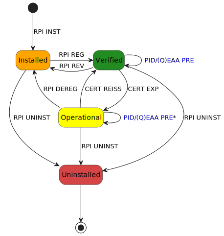

.. include:: ../common/common_definitions.rst

.. _relying-party-instance:

Relying Party Instance
=========================

The Relying Party Instance (RPI) is a distinct and secure application designed to request, receive, and process Digital Credentials from Wallet Instances in a trusted manner. Each instance ensures the integrity, confidentiality and authenticity of credential exchanges, enabling secure interactions between Users and Relying Parties.

There are two primary types of Relying Party Instances, each serving different operational environments:

- **Mobile Relying Party Instance**: a native application running on a mobile device (e.g., smartphone or tablet). Each instance corresponds to a specific installation of the application on a device. A Mobile Relying Party Instance functions as a public client, operating on end-user devices where sensitive credentials cannot be fully protected from potential threats. This implies additional security measures to establish and maintain trust.
- **Web Relying Party Instance**: a remote application operated by the Relying Party. A Web Relying Party Instance operates as a confidential client, meaning it can securely store credentials (such as private keys) on a server controlled by the Relying Party. In this context, the Relying Party has direct control over the authentication and verification process.

.. note::
  
  Unlike the Web Relying Party Instance, a Mobile Relying Party Instance requires proper lifecycle management and special registration procedures managed through the Relying Party Backend.

Further technical and operational details are discussed in the following sections.

Mobile Relying Party Instance
--------------------------------

Mobile Relying Party Instance Lifecycle
~~~~~~~~~~~~~~~~~~~~~~~~~~~~~~~~~~~~~~~~~~

In this section, state machines are presented to explain the Mobile Relying Party Instance states, as well as their transitions and relations.

.. _fig_RelyingParty_Instance_Mobile_Lifecycle:

ST86hVFzG8m-alfwKSTI4cFTosHb3XPevHV7J6RAVPSbUe6_dbmzNzFL2W965vFwoUixTqVamWDbEw0l0UbKBsNiisNUPgdL6FN3iC_qJV-9F6eoT_l_cCQQLcFjxdLi8BDIur28BtHl76yngKuUMMBAoqH-0m00

    Lifecycle of the Mobile Relying Party Instance

As shown in :numref:`fig_RelyingParty_Instance_Mobile_Lifecycle`, the Mobile Relying Party Instance has four distinct states: **Installed**, **Operational**, **Verified**, and **Uninstalled**. Each state represents a specific functional status and determines the actions that can be performed.

Transition to Installed
^^^^^^^^^^^^^^^^^^^^^^^^^

The state machine begins with the Relying Party Instance installation (**RPI INST** transition), where Users download and install a Relying Party Instance using the official app store of their device's operating system, leading to the **Installed** state.

While in this state, the Relying Party Instance MUST interact only with the Relying Party Backend to be registered (i.e., to verify the Instance integrity, register Hardware Cryptographic Keys and obtain an Access Certificate).

When the revocation of the Relying Party Instance occurs (**RPI REV** transition), the Relying Party Instance MUST go back from **Operational** to **Installed**. This transition implies the following operations:

1. The Access Certificate MUST be revoked.
2. The Hardware Cryptographic Keys MUST be deleted.

Revocation can occur in the following cases:

- For security reasons (e.g., compromise of cryptographic material).
- For technical reasons (e.g., deprecation of the Relying Party Solution).
- In case of Relying Party de-registration (as detailed in `EIDAS-ARF`_, Section 6.4.3).
- Illegal activities reported by Judicial or Supervisory Bodies.

In addition, each Relying Party SHOULD set an amount of time (grace period) during which the Relying Party Instance can request presentations of Digital Credentials by authenticating itself towards a Wallet Instance using an expired Access Certificate. After this period, the Relying Party Instance MUST be de-registered (**RPI DEREG** transition) and go back to the **Installed** state. This transition implies that the Hardware Cryptographic Keys MUST be deleted.

Transition to Verified
^^^^^^^^^^^^^^^^^^^^^^^^^

The Relying Party Instance needs to obtain a proper Access Certificate, which will be used to authenticate itself towards Wallet Instances. This certificate is obtained by interacting with the Relying Party Backend, which in turns communicates with the Relying Party Instance Access Certificate Authority. Specifically, the registration transition (**RPI REG**) consists of the following operations, leading to the **Verified** state:

1. After verification of the Relying Party Instance integrity, it registers a pair of Hardware Cryptographic Keys.
2. The Relying Party Instance obtains an Access Certificate.

In case the Access Certificate is expired, a new certificate can be issued to the Relying Party Instance; this operation is represented by the **CERT REISS** transition towards the **Verified** state.

While in this state, the Relying Party Instance can request the presentation of Digital Credentials to Wallet Instances (**PID/(Q)EAA PRE**), using the Access Certificate to authenticate itself.

Transition to Operational
^^^^^^^^^^^^^^^^^^^^^^^^^^^

The expiration of the Access Certificate (**CERT EXP** transition) leads to the **Operational** state.

While in this state, the Relying Party Instance can still request the presentation of Digital Credentials to Wallet Instances for a grace period. However, as the certificate is expired, a specific disclaimer MUST be displayed to the User of the Wallet Instance during the presentation flow; for this reason, this operation is represented by the label **PID/(Q)EAA PRE***. This is required to support offline presentation flows. After the grace period has passed, the Relying Party Instance will no longer be able to request presentations and will be de-registered.

Transition to Uninstalled
^^^^^^^^^^^^^^^^^^^^^^^^^^^
Across the **Installed**, **Verified** and **Operational** states, the Relying Party Instance can be removed entirely through the Relying Party Instance uninstall (**RPI UNINST**) transition, leading to the **Uninstalled** state. If a Relying Party Instance is **Uninstalled**, it ends its lifecycle.

Mobile Relying Party Instance Functionalities
~~~~~~~~~~~~~~~~~~~~~~~~~~~~~~~~~~~~~~~~~~~~~~~~

A Mobile Relying Party Instance MUST support three fundamental functionalities: **Registration**, **Access Certificate Reissuance**, and **Revocation**. Each functionality is described in detail in the following sections.

.. note::

  The details provided below are non-normative and are intended to clarify the functionalities of the Mobile Relying Party Instance. The actual implementation may vary based on the specific use case and requirements of the Relying Party.

Mobile Relying Party Instance Registration
^^^^^^^^^^^^^^^^^^^^^^^^^^^^^^^^^^^^^^^^^^^^

This section describes the registration of the Mobile Relying Party Instance.

The Registration Flow is composed by the following sub flows:

- Device Integrity Check and Key Registration.
- Access Certificate Issuance.

.. note::
  
  Access Certificates MAY be issued as short-lived (typically valid within 24 hours) or long-lived.

The overall flow is displayed in :numref:`fig_RelyingParty_Instance_Mobile_Registration`, while a step-by-step description is provided below.

.. _fig_RelyingParty_Instance_Mobile_Registration:

G3peKmwTg-cJNMfDpB0YmHwDHa-m3BxkOYc3aiQYY9r-yQtK_Wm_Ox2w1bzJxAM93DFPE1jpHZy4Yw9oNUZXJMUhclG9q9Rm4Ltv9pg2d-WYuweCUvU4-lwQAQ7DSSXLNhLQ8iz3e3NMjA459Xq6SKT_1EEe9Ulvaur9XFfFmmN3W6Sq3HuQAgv9PMJFi14LOWzAwHgRXcn5IetTnR4MyfFGFv8b5-D7Hrndf06NUfcUb3GH77iU1LVkqlkkSjZNHa_6nT2ZSV2aL9sY-nDTzdquABM0FEhCMQbtrtcmxzmzPTXXzKRNOoK2BpMYvwoP1SmHneb5Yh3bDz777fMAUFIUs0-NhrH2fcdC0KhAfCUxo-lAsG-BpQ_tTsnCAV6fyZmYJpR5RUFePv9dQvAxGVvmtrcc8jyPiYKCBfD7QhjRRdQm-h3PhNzOhvQx3yb_CzPUCuVe-ncRtLqv-SZyaYsiG41wUjtDoKhURE9_yzg_jDh_SfeG6aFMxqlq2D_0qoj_0QcBTqezfkvhv5husu_BBx_w-kdcHEYvVp9QRfZS1kRb_TeZCxcxLiXA75UEJMNH1qTIPFn-ogjOm9ktOxxpsmSrEI0kQxhFsok-ZvkzwhIH39szIvyO9mDcvdcy1HEJR6KunbOlYU8wQtRPygROj8VP9X8o7MgSuMei2et3uP1zv4ZqDI4EVjxhiTJf4cYSpEGH8Hz6UgJcQUE3SoiWj450KWOczpnzl3WCGiVG5E-57jhcRm00

    Flow of the Mobile Relying Party Instance Registration

**Device Integrity Check and Hardware Key Registration**

**Step 1:** The User launches the Mobile Relying Party Instance.

**Step 2:** The Mobile Relying Party Instance:

  - Checks whether the device meets the minimum security requirements.
  - Checks if the Device Integrity Service is available.

**Steps 3-5:** The Mobile Relying Party Instance requests a fresh ``challenge`` from the Nonce endpoint of the Relying Party Backend. This ``challenge``, known as a ``nonce``, MUST be unpredictable to serve as the main defense against replay attacks.

.. code-block:: http
    :caption: Non-normative example of the Mobile Relying Party Nonce Request
    :name: _code_RelyingParty_Instance_Mobile_Registration_Nonce_Request

    GET /nonce HTTP/1.1
    Host: relying-party.example.com

Upon a successful request, the Relying Party Backend generates and returns the nonce value to the Mobile Relying Party Instance. The Backend MUST ensure that it is single-use and valid only within a specific time frame.

.. code-block:: http
    :caption: Non-normative example of the Mobile Relying Party Nonce Response
    :name: _code_RelyingParty_Instance_Mobile_Registration_Nonce_Response

    HTTP/1.1 200 OK
    Content-Type: application/json

    {
      "nonce": "0fe3cbe0-646d-44b5-8808-917dd5391bd9"
    }

**Step 6:** The Mobile Relying Party Instance, through the operating system, creates a pair of Cryptographic Hardware Keys and stores the corresponding Cryptographic Hardware Key Tag in local storage once the following requirements are met:

  1. It MUST ensure that Cryptographic Hardware Keys do not already exist. If they do exist and the Mobile Relying Party Instance is in the **Installed** state, they MUST be deleted.
  2. It MUST generate a pair of asymmetric Elliptic Curve keys (Cryptographic Hardware Keys) via a local WSCD.
  3. It SHOULD obtain a unique identifier (Cryptographic Hardware Key Tag) for the generated Cryptographic Hardware Keys from the operating system. If the operating system permits specifying a tag during the creation of keys, then a random string for the Cryptographic Hardware Key Tag MUST be selected. This random value MUST be collision-resistant and unpredictable to ensure security. To achieve this, consider using a cryptographic hash function or a secure random number generator provided by the operating system or a reputable cryptographic library.
  4. If the previous points are satisfied, it MUST store the Cryptographic Hardware Key Tag in local storage.

**Step 7:** The Mobile Relying Party Instance uses the Device Integrity Service, providing the challenge and the Cryptographic Hardware Key Tag to acquire the Key Attestation.

**Steps 8-9:** The Device Integrity Service performs the following actions:

  1. Creates a Key Attestation that is linked with the provided challenge and the Cryptographic Hardware Key Tag.
  2. Incorporates information pertaining to the device's security.
  3. Uses an OEM private key to sign the Key Attestation, therefore verifiable with the related OEM certificate, confirming that the Cryptographic Hardware Keys are securely managed by the operating system.
  4. Returns the Key Attestation to the Relying Party Instance.

**Step 10:** The Mobile Relying Party Instance requests the Hardware Key Registration by sending the following claims to the Relying Party Backend: ``challenge``, Key Attestation (``key_attestation``), and Cryptographic Hardware Key Tag (``hardware_key_tag``).

.. code-block:: http
    :caption: Non-normative example of the Mobile Relying Party Instance Hardware Key Registration Response
    :name: _code_RelyingParty_Instance_Mobile_Registration_InstanceRegistration_Request

    POST /hardware-key-registration HTTP/1.1
    Host: relying-party.example.com
    Content-Type: application/json

    {
      "challenge": "0fe3cbe0-646d-44b5-8808-917dd5391bd9",
      "key_attestation": "o2NmbXRvYXBwbGUtYXBw...",
      "hardware_key_tag": "WQhyDymFKsP95iFqpzdEDWW4l7aVna2Fn4JCeWHYtbU="
    }

**Steps 11-13:** The Relying Party Backend validates the ``challenge`` and ``key_attestation`` signature, therefore:

  1. It MUST verify that the ``challenge`` was generated by the Relying Party Backend and has not already been used.
  2. It MUST validate the ``key_attestation`` as defined by the device manufacturers' guidelines.
  3. It MUST verify that the device in use has no security flaws and reflects the minimum security requirements defined by the Relying Party Backend.
  4. If these checks are passed, it stores the Cryptographic Hardware Key Tag.

**Step 14:** The Relying Party Backend responds with a confirmation of success.

.. code-block:: http
    :caption: Non-normative example of the Mobile Relying Party Instance Hardware Key Registration Response
    :name: _code_RelyingParty_Instance_Mobile_Registration_InstanceRegistration_Response
  
    HTTP/1.1 204 No content

**Access Certificate Issuance**

**Steps 15-16:** The Mobile Relying Party Instance MUST:

  1. Verify the existence of Cryptographic Hardware Keys. If none exist, the process MUST restart from the previous phase.
  2. Generate an asymmetric key pair for the Access Certificate (``key_pub``, ``key_priv``).

**Steps 17-19:** The Mobile Relying Party Instance requests a fresh ``challenge`` from the Nonce endpoint of the Relying Party Backend. This ``challenge``, known as a ``nonce``, MUST be unpredictable to serve as the main defense against replay attacks.

Upon a successful request, the Relying Party Backend generates and returns the nonce value to the Mobile Relying Party Instance. The Relying Party Backend MUST ensure that it is single-use and valid only within a specific time frame.

Non-normative examples of the Nonce Request and Response can be found in :numref:`_code_RelyingParty_Instance_Mobile_Registration_Nonce_Request` and :numref:`_code_RelyingParty_Instance_Mobile_Registration_Nonce_Response`, respectively.

**Step 20:** The Mobile Relying Party Instance generates ``client_data``, a JSON object that includes the challenge and the thumbprint of ``key_pub``, obtained from its ``JWK`` representation.

.. code-block:: json
    :caption: Non-normative example of the ``client_data`` JSON object
    :name: _code_RelyingParty_Instance_Mobile_Registration_client_data

    {
      "challenge": "f3b29a81-45c7-4d12-b8b5-e1f6c9327aef",
      "jwk_thumbprint": "hT3v7KQjFZy6GvDkYgOZ1u2F6T4Nz5bPjX8o1MZ3dJY"
    }

**Step 21:** The Mobile Relying Party Instance computes ``client_data_hash`` by applying the SHA256 algorithm to ``client_data``.

**Steps 22-23:** The Mobile Relying Party Instance:

  1. Requests the Device Integrity Service to create an ``integrity_assertion`` value linked to the ``client_data_hash``.
  2. Receives a signed ``integrity_assertion`` value from the Device Integrity Service, authenticated by the OEM.

**Steps 24-26:** The Mobile Relying Party Instance:

  1. Produces an ``hardware_signature`` value by signing the ``client_data_hash`` with the Hardware Cryptographic private key, serving as a proof of possession for the Cryptographic Hardware Keys.
  2. Generates the Integrity Validation Request in the form of a JWT. This JWT includes ``integrity_assertion``, ``challenge``, ``hardware_signature``, ``hardware_key_tag``, ``key_pub`` and is signed using ``key_priv``.
  3. Submits the Integrity Validation Request to the Relying Party Backend.

.. code-block::
    :caption: Non-normative example of the Mobile Relying Party Integrity Validation Request JWT, without encoding and signature applied
    :name: _code_RelyingParty_Instance_Mobile_Registration_IntegrityValidation_JWT

    {
      "alg": "ES256",
      "kid": "hT3v7KQjFZy6GvDkYgOZ1u2F6T4Nz5bPjX8o1MZ3dJY",
      "typ": "ivr+jwt"
    }
    .
    {
      "iss": "https://relying-party.example.org/instance/hT3v7KQjFZy6GvDkYgOZ1u2F6T4Nz5bPjX8o1MZ3dJY",
      "sub": "https://relying-party.example.org/",
      "challenge": "f3b29a81-45c7-4d12-b8b5-e1f6c9327aef",
      "hardware_signature": "MIIBIjANBgkqhkiG9w0BAQEFAAOCAQ8AMIIBCgKCAQEArzG8Kmv1...",
      "integrity_assertion": "o2NmbXRvYXBwbGUtYXBwYXNzZXJ0aW9uLXBheWxvYWQtYXBw...",
      "hardware_key_tag": "QW12DylRTmF89iGkpydNDWW7m8bVpa2Fn9KBeXGYtfX"
      "cnf": {
        "jwk": {
          "crv": "P-256",
          "kty": "EC",
          "x": "8FJtI-yr3pjyRKGMnz4WmdnQD_uJSq4R95Nj98b44",
          "y": "MKZnSB39vFJhYgS3k7jXE4r3-CoGFQwZtPBIRqpNlrg"
        }
      },
    }

The Mobile Relying Party Instance MUST send the signed Integrity Validation Request JWT as an ``assertion`` parameter in the body of an HTTP request to the Relying Party Backend.

.. code-block:: http
    :caption: Non-normative example of the Mobile Relying Party Integrity Validation Request
    :name: _code_RelyingParty_Instance_Mobile_Registration_IntegrityValidation_Request

    POST /integrity-validation HTTP/1.1
    Host: relying-party.example.org
    Content-Type: application/json

    {
      "assertion": "eyJhbGciOiJFUzI1NiIsImtpZCI6ImtoakZWTE9nRjNHeG..."
    }

**Step 27:** The Relying Party Backend evaluates the Integrity Validation Request and performs the following checks:

  1. The Relying Party Instance has valid Cryptographic Hardware Keys registered.
  2. The signature of the Integrity Validation Request MUST be valid and verifiable using the provided key.
  3. The ``challenge`` value MUST have been generated by the Relying Party Backend and not previously used.
  4. The ``integrity_assertion`` MUST be validated according to the device manufacturer's guidelines.
  5. The ``client_data`` MUST be reconstructed using the challenge and the jwk public key. The ``hardware_signature`` parameter value is then validated using the registered Cryptographic Hardware Key's public key associated with the Wallet Instance.
  6. The device in use MUST be free of known security flaws and meet the minimum security requirements defined by the Relying Party.
  7. The URL in the ``iss`` parameter MUST match the Relying Party's URL identifier.

**Step 28:** If the check are successful, the Relying Party Backend responds with a confirmation of success.

.. code-block:: http
    :caption: Non-normative example of the Mobile Relying Party Integrity Validation Response
    :name: _code_RelyingParty_Instance_Mobile_Registration_IntegrityValidation_Response
  
    HTTP/1.1 204 No content

**Step 29:** The Mobile Relying Party Instance generates a Certificate Signing Request (CSR, ``csr``) using the pair of keys generated at step 16.

**Step 30:** The Mobile Relying Party Instance sends the CSR to the Relying Party Backend.

.. code-block:: http
    :caption: Non-normative example of the Mobile Relying Party Access Certificate Request
    :name: _code_RelyingParty_Instance_Mobile_Registration_AccessCertificate_Request

    POST /access-certificate HTTP/1.1
    Host: relying-party.example.org
    Content-Type: application/json

    {
      "csr": "MIIBvzCCAa..."
    }

**Steps 31-32:** The Relying Party Backend checks that the public key in the CSR corresponds to a Relying Party Instance that has been previously validated, i.e., that it matches the one bound to the Cryptographic Hardware Keys through ``hardware_signature``. If this check is successful, the Relying Party Backend sends the CSR to the Relying Party Instance Access Certificate Authority.

**Steps 33-34:** The Relying Party Instance Access Certificate Authority signs the the CSR, obtaining a valid Access Certificate (``access_certificate``) which it sends back to the Relying Party Backend.

**Steps 35-36:** The Relying Party Backend sends the Access Certificate to the Mobile Relying Party Instance, which stores it for future authentication towards Wallet Instances.

.. code-block:: http
    :caption: Non-normative example of the Mobile Relying Party Access Certificate Response
    :name: _code_RelyingParty_Instance_Mobile_Registration_AccessCertificate_Response

    HTTP/1.1 200 OK
    Content-Type: application/json

    {
      "access_certificate": "hajdnhaghSDGns..."
    }

**Step 37:** The Mobile Relying Party Instance has been registered.

Mobile Relying Party Instance Access Certificate Reissuance
^^^^^^^^^^^^^^^^^^^^^^^^^^^^^^^^^^^^^^^^^^^^^^^^^^^^^^^^^^^^^^^^

The issuance of a new Access Certificate follows the same flow described in Section :ref:`Mobile Relying Party Instance Registration` for **Access Certificate Issuance**. Those certificates MAY be issued as short-lived (typically valid within 24 hours) or long-lived.

Mobile Relying Party Instance Revocation
^^^^^^^^^^^^^^^^^^^^^^^^^^^^^^^^^^^^^^^^^^^

Relying Parties MUST periodically verify the Relying Party Instance's authenticity and security.
When security issues are detected, Relying Parties MUST revoke the Relying Party Instance, revoking its X.509 Access Certificate (in case of long-lived certificates), and in any case, Relying Parties MUST NOT allow the re-issue of certificates. 
As a result, Mobile Relying Party Instance revocation MUST be tied to X.509 Access Certificates validity.

Long-lived certificates MUST implement the standard revocation mechanisms as defined in :rfc:`5280`, including Certificate Revocation Lists (CRLs) and/or Online Certificate Status Protocol (OCSP).
These revocation mechanisms are aligned with the trust model described in Section :ref:`The Infrastructure of Trust`, ensuring consistent and reliable certificate validation across the ecosystem.

Web Relying Party Instance
--------------------------------

As mentioned in the introduction, a Web Relying Party Instance differs from Mobile Relying Party in its security classification and operational model. While Web Instances operate as confidential clients with server-side security controls that can safely store secrets and cryptographic keys in a controlled environment, Mobile Instances function as public clients running on end-user devices where security guarantees are inherently limited. This fundamental difference necessitates distinct approaches to registration, lifecycle management, and trust establishment. Web Instances can be directly registered with the Trust Anchor or Intermediary Entities through federation endpoints, while Mobile Instances require device attestation, hardware-backed key verification, and Access Certificates issued by the Relying Party Backend to establish and maintain trust within the IT-Wallet ecosystem.

Web Relying Party Instance Functionalities
~~~~~~~~~~~~~~~~~~~~~~~~~~~~~~~~~~~~~~~~~~~~~~~~

A Web Relying Party Instance MUST support two fundamental functionalities: **Registration** and **Revocation**. Each functionality is described in the following sections.

Web Relying Party Instance Registration
^^^^^^^^^^^^^^^^^^^^^^^^^^^^^^^^^^^^^^^^^^^

Web Relying Party Instances, as confidential clients, are registered directly with the Trust Anchor or an Intermediary Entity. The registration involves:

- The Relying Party MUST register its Web Instance with the Trust Anchor or Intermediary.
- The Relying Party MUST expose an Entity Configuration as defined in the Trust Framework.
- The Entity Configuration MUST contain all necessary metadata for federation, including endpoints and public keys.
- No individual instance lifecycle management is required, as the Web Instance operates as part of the secured server environment.

Web Relying Party Instance Revocation
^^^^^^^^^^^^^^^^^^^^^^^^^^^^^^^^^^^^^^^^

When a Web Relying Party Instance needs to be revoked:

- The revocation MUST be performed according to the Trust Framework procedures.
- The cryptographic keys used by the Web Instance MUST be revoked.
- The Entity Configuration MUST be updated to reflect the revocation.
- The Trust Anchor MUST be notified of the revocation to update federation metadata.
