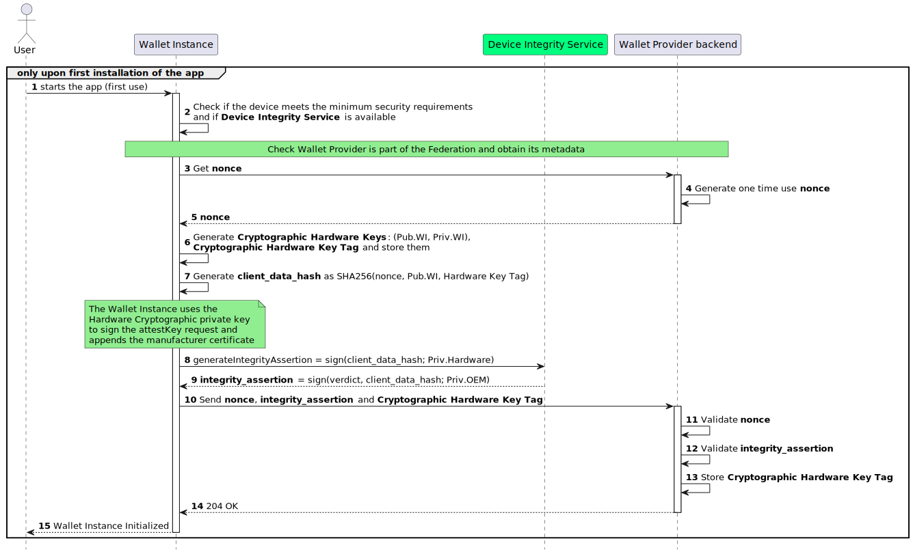

.. include:: ../common/common_definitions.rst

.. _wallet-solution.rst:

Wallet Solution
^^^^^^^^^^^^^^^^^^^^^^^^^^^^^^^^^^^

The Wallet Solution is issued by the Wallet Provider in the form of a mobile app and services, such as web interfaces. The mobile app serves as the primary interface for Users, allowing them to hold their Digital Credentials and interact with other participants of the ecosystem, such as Credential Issuers and Relying Parties. These Credentials are a set of data that can uniquely identify a natural or legal person, along with other Qualified and non-qualified Electronic Attestations of Attributes, also known as QEAAs and EAAs respectively, or (Q)EAAs for short. Once a User installs the mobile app on their device, such an installation is referred to as a Wallet Instance for the User. By supporting the mobile app, the Wallet Provider ensures the security and reliability of the entire Wallet Solution, as it is responsible for issuing the Wallet Attestation, which is a cryptographic proof about the authenticity and integrity of the Wallet Instance.

Wallet Solution Requirements
-----------------------------

This section lists the requirements that Wallet Providers, Wallet Solutions, and their Wallet Instances must meet.

- The Wallet Provider MUST expose a set of endpoints, exclusively available to its Wallet Solution instances, supporting the core functionalities of the Wallet Instances.
- The Wallet Instance MUST periodically reestablish trust with its Wallet Provider, obtaining a fresh Wallet Attestation.
- The Wallet Instance MUST establish trust with other participants of the Wallet ecosystem, such as Credential Issers and Relying Parties, presenting a Wallet Attestation.
- The Wallet Solutions MUST adhere to the specifications set by this document for obtaining Personal Identification (PID) and (Q)EAAs.
- The Wallet Instance MUST be compatible and functional on both Android and iOS operating systems and available on the Play Store and App Store, respectively.
- The Wallet Instance MUST provide a mechanism to verify the User's actual possession and full control of their personal device.

Wallet Attestation Requirements
~~~~~~~~~~~~~~~~~~~~~~~~~~~~~~~
Wallet Attestation contains information regarding the security level of the device hosting the Wallet Instance.
It primarily certifies the **authenticity**, **integrity**, **security**, **privacy**, and **trustworthiness** of a particular Wallet Instance.

The requirements for the Wallet Attestation are defined below:

- The Wallet Attestation MUST provide all the relevant information to attest to the **integrity** and **security** of the device where the Wallet Instance is installed.
- The Wallet Attestation MUST be signed by the Wallet Provider that has authority over and is the owner of the Wallet Solution, as specified by the overseeing registration authority. This ensures that the Wallet Attestation uniquely links the Wallet Provider to this particular Wallet Instance.
- The Wallet Provider MUST ensure the integrity, authenticity, and genuineness of the Wallet Instance, preventing any attempts at manipulation or falsification by unauthorized third parties. The Wallet Provider MUST also verify the Wallet Instance using the available OS Provider's API and MSUT do so using the securest flow alloweded by the OS Provider's API. Examples include *Play Integrity API* for Android and *App Attest* for iOS. 
- The Wallet Provider MUST possess a revocation mechanism for the Wallet Instance, allowing the Wallet Provider to terminate service for a specific Instance at any time.
- The Wallet Attestation MUST be securely bound to the Wallet Instance's ephemeral public key.
- The Wallet Attestation MAY be used multiple times during its validity period, allowing for repeated authentication and authorization without the need to request new attestations with each interaction. However, it is RECOMMENDED that Wallet Instances avoid using the same attestation repeatedly, due to privacy concerns such as linkability between different interactions. 
- The Wallet Attestation MUST be short-lived and MUST have an expiration time, after which it MUST no longer be considered valid.
- The Wallet Attestation MUST NOT be issued by the Wallet Provider if the authenticity, integrity, and genuineness of the Wallet Instance requesting it cannot be guaranteed.
- Each Wallet Instance SHOULD be able to request multiple Wallet Attestations using different cryptographic public keys associated with them.
- The Wallet Attestation MUST NOT contain information about the User in control of the Wallet Instance.
- The Wallet Instance MUST secure a Wallet Attestation as a prerequisite for transitioning to the Operational state, as defined by :ref:`ARF`.

.. figure:: ../../images/static_view_wallet_instance_attestation.svg
    :figwidth: 100%
    :align: center
    :target: https://www.plantuml.com/plantuml/svg/VP8nJyCm48Lt_ugdTexOCw22OCY0GAeGOsMSerWuliY-fEg_9mrEPTAqw-VtNLxEtaJHGRh6AMs40rRlaS8AEgAB533H3-qS2Tu2zxPEWSF8TcrYv-mJzTOGNfzVnXXJ0wKCDorxydAUjMNNYMMVpug9OTrR7i22LlaesXlADPiOraToZWyBsgCsF-JhtFhyGyZJgNlbXVR1oX5R2YSoUdQYEzrQO1seLcfUeGXs_ot5_VzqYM6lQlRXMz6hsTccIbGHhGu2_hhfP1tBwHuZqdOUH6WuEmrKIeqtNonvXhq4ThY3Dc9xBNJv_rSwQeyfawhcZsTPIpKLKuFYSa_JyOPytJNk5m00

    Wallet Solution Schema

.. note:: 

  Throughout this section, the services used to attest genuineness of the Wallet Instance and the device in which it is installed are referred to as **Device Integrity Service (DIS)**. the Device Integrity Service is considered in an abstract fashion and it is assumed to be a service provided by a trusted third party (i.e., the OS Provider's API) which is able to perform integrity checks on the Wallet Instance as well as on the device where it is installed.

WSCD Requirements
~~~~~~~~~~~~~~~~~~~~~~~~~~~~~~~
To guarantee the utmost security, the cryptographic keys associated with a Wallet Instance (e.g., used to generate the Wallet Attestation) MUST be securely generated and stored within the Wallet Secure Cryptographic Device (WSCD).
This ensures that only the User can access these keys, thus preventing unauthorized usage or tampering. The WSCD MAY be implemented using at least one of the approaches listed below:

- **Local Internal WSCD**: The WSCD relies entirely on the device's native cryptographic hardware, such as the Secure Enclave on iOS, or the Trusted Execution Environment (TEE) and Strongbox on Android.
- **Local External WSCD**: The WSCD is hardware external to the User's device, such as a smart card compliant with *GlobalPlatform* and supporting *JavaCard*.
- **Remote WSCD**: The WSCD utilizes a remote Hardware Security Module (HSM).
- **Local Hybrid WSCD**: The WSCD involves a pluggable internal hardware component within the User's device, such as an *eUICC* that adheres to *GlobalPlatform* standards and supports *JavaCard*.
- **Remote Hybrid WSCD**: The WSCD involves a local component mixed with a remote service.

.. warning::
  At the current stage, the implementation profile defined in this document supports only the **Local Internal WSCD**. Future versions of this specification MAY include other approaches depending on the required Authenticator Assurance Level (`AAL`).

For more detailed information, please refer to :ref:`Wallet Instance Initialization and Registration` and :ref:`Wallet Attestation Issuance`  of this document. 

Wallet Instance
------------------------------

The Wallet Instance establishes a strong and reliable mechanism for the User to engage in various digital transactions in a secure and privacy-preserving manner.

The Wallet Instance allows other entities within the ecosystem to establish trust with it, by consistently
presenting a Wallet Attestation during interactions with PID Providers,
(Q)EAA Providers, and Relying Parties. These verifiable attestations, provided by the Wallet Provider,
serve to authenticate the Wallet Instance itself, ensuring its reliability when engaging with other ecosystem actors.

Wallet Instance Lifecycle
~~~~~~~~~~~~~~~~~~~~~~~~~~~~~~~

The Wallet Provider is in charge of the implementation and provision of Wallet Instances also handling their entire lifecycle.

In this section, state machines are presented to explain the Wallet Instance and Digital Credential states and their transitions and relations.

.. note::

  PID is a specialized Digital Credential type that has impacts on the Wallet Instance's lifecycle. The revocation of the PID MAY also have potential impacts on (Q)EAAs, if they were issued using the presentation of the PID. 
  When the distinction between PID and (Q)EAA is not needed, the term Digital Credential is used.

As shown in :numref:`fig_Wallet_Instance_States`, the Wallet Instance has four distinct states: **Installed**, **Operational**, **Valid**, and **Uninstalled**.
Each state represents a specific functional status and determines the actions that can be performed.

.. _fig_Wallet_Instance_States:
.. figure:: ../../images/Wallet_Instance_States.svg
    :figwidth: 100%
    :align: center
    :target: https://www.plantuml.com/plantuml/svg/XPBHIuH04CRVzwyOk9SAH8ipGaHESW-4kEpihg1wi7ElMzXRHLUY_lfMAvtMZlD5cUytttpZxgnMMQMQlI0xdZDW-r9zGCxgJSLBnGj9Y0OKWrZgjn0iXyby7hgEyrE_BLcLjM0cOBBLJw-iCy4rxJXNJbzRIJxuH9TJT-eI0W1FPozWvSMxj89XaWSFCSIBzBubXd8FjcOONIt-Wol-jbEQHa4xEhpkK5m_xcpWWctLAF6IhaUaET_V5AAel5VHiE3axfI68SHfQYTBwjkT51pCrltMlmv97BNjkFKR0wifZT5c7trCxDz6U9POrelO4RqvP3jU6n4egB4gnQlYiJWLKf7fyUF14bWQrHTBHwZv9_FEBmBVRhy2CcCorrV-2m00

    Wallet Instance Lifecycle.

.. note::

  The Wallet Provider MUST ensure the security and reliability of the Wallet Instances. To achieve this, the Wallet Provider MUST periodically check the Wallet Instances security and compliance status. 

Transition to Installed
....................................
The state machine begins with the Wallet Instance installation (**WI INST**) transition, where Users download and install a Wallet Instance provided by the Wallet Provider using the
official app store of their device's operating system (this ensures authenticity via system checks), leading to the **Installed** state.

When the state is **Installed**, the Wallet Instance MUST interact only with the Wallet Provider to be activated. When the revocation of the Wallet Instance occurs, the Wallet Instance MUST go back from **Operational** or **Valid** to **Installed**. The revocation marks the Wallet Cryptographic Hardware Key, registered during activation 
(see :ref:`Transition to Operational`), as not usable anymore. Revocation can occur in the following cases:

* for technical security reasons (e.g., relating to the compromise of cryptographic material); 
* in case of explicit User requests (e.g., due to loss, or theft of the Wallet Instance);
* death of the User;
* illegal activities reported by Judicial or Supervisory Bodies.

.. note::

  While for the ARF the revocation of the Wallet Instance is accomplished by revoking the Wallet Attestation (see Topic 9 and Topic 38 in Annex 2),
  in this specification the revocation is managed differently. Being the Wallet Attestation short-lived, it does not have a status management mechanism.
  For this reason, the Wallet Instance revocation transition is accomplished by deleting the Wallet Cryptographic Hardware Key from the WSCD of the Wallet
  Instance and from the account associated with the User. This transition is completed when the Wallet Instance is online.

Transition to Operational
....................................

After installation, the User opens the Wallet Instance and an activation begins (**WI ACT**). 
At this stage, a User account MUST be created with the Wallet Provider and associated with the Wallet Instance through the Wallet Cryptographic 
Hardware Key Tag, subject to obtaining the User's consent (see :ref:`Wallet Instance Initialization and Registration` for more details). 
This association allows the User to directly request Wallet Instance revocation from the Wallet Provider, and it also allows the Wallet Provider to 
revoke the Wallet Instance associated with that User.

.. note::

  As a result of the User account creation, an authentication mechanism MUST be set for the User to interact with the Wallet Provider portal.
  This specification mandates the use of at least a second-factor for User authentication.

As part of the activation, the Wallet Provider MUST evaluate the operating system and general technical capabilities of the device to check compliance
with the technical and security requirements, and the authenticity and integrity of the installed Wallet Instance.
Upon successful verification, the Wallet Provider MUST issue at least one valid Wallet Attestation to the Wallet Instance, therefore the Wallet Instance enters the **Operational** state.

In addition, if not already done, Users MUST set their preferred method of unlocking their Wallet Instance; this MAY be accomplished by entering a 
personal identification number (PIN) or by utilizing biometric authentication, such as fingerprint or facial recognition, according to personal 
preferences and device's capabilities. Please refer to :ref:`Wallet Attestation Issuance`.

In the **Operational** state, Users can request the issuance of PID (**PID ISS**) or (Q)EAAs if the PID is not required in the issuance
(**(Q)EEA ISS**). In addition, if the Digital Credentials are (Q)EEAs and for the presentation they do not require the PID, they can be presented
without transitioning the Wallet Instance to another state (**(Q)EEA PRE** transition).

A **Valid** Wallet Instance MUST transition back to the **Operational** state due to **PID EXP/REV/DEL** transition, when the associated PID expires, is revoked by its Provider or either deleted by the User. 

Transition to Valid
....................................
A transition to the Valid state occurs only when the Wallet Instance obtains a valid PID (**PID ISS**). In this state, Users can obtain and present
new (Q)EAAs (**(Q)EAA ISS/PRE**), and present the PID (**PID PRE**). Please refer to :ref:`PID/(Q)EAA Issuance` and :ref:`PID/(Q)EAA Presentation`.

.. note::

  Users can have only one Wallet Instance in **Valid** state for the same Wallet Solution. Thus, when a User installs and obtains a PID on a new Wallet
  Instance of the same Wallet Solution from the same Wallet Provider, the PID in the previous Wallet Instance MUST be revoked and the Wallet Instance became
  **Operational**.

Transition to Uninstalled
....................................

Across all states, **Installed**, **Activated**, **Operational**, or **Valid**, the Wallet Instance can be removed entirely through the Wallet Instance 
uninstall (**WI UNINST**) transition, leading to the **Uninstalled** state. If a Wallet Instance is **Uninstalled** it ends its lifecycle.

Wallet Instance Lifecycle Management
~~~~~~~~~~~~~~~~~~~~~~~~~~~~~~~~~~~~~~~~~

While :numref:`fig_Wallet_Instance_States` shows the different states a Wallet Instance may acquire during its lifecycle,
:numref:`fig_Wallet_Instance_Lifecycle` shows the point of view of Wallet Instances and Wallet Providers in managing the Wallet Instance lifecycle
and the effect on their local storage.

.. _fig_Wallet_Instance_Lifecycle:
.. figure:: ../../images/wallet_instance_lifecycle.svg
    :figwidth: 100%
    :align: center
    :target: https://www.plantuml.com/plantuml/svg/dP9Vgvim6CRl_HIPd0k5ddgpgq7XE0sSGhUAUbO6WnBDYnLYuf9NkpBstPUurPLEs9yRBzuyloV-aZmPP1g7JdYlMbcBWGCv8VRcJHHfTbutBPw6QZ2WQoKH9AvhrKMzOD8nZmQvQAieUVsOkT7BkrtKCOEWxUYOM8Ar4lIwT_tFsvGUYvBcT5z-p6WGUbxnl3ySCveN-_V7R9-NURmjtJpcF0THiYRmUUMlo0F25qoKK7hZAyra0sueRFVYiC2B0B8XAJCdu3ix2KBR-bODaZDz2OPgHVm34mAGRAL19ciWrrK_95yzuX5INAn85x3wyq8whh4T6RPAaayoE6n9d9IXRuD--0lb81RG74PLtw8v_N15BJkVMbe5PuDAh_p2Vba3SxttpRkngMziCgt6beE-ixd-K0FoVrqqZF_cSgSocP3VLEP8q0zkFMN8I3ReffND55ezc5wt21jVgqgXXPny3k87yBCsfJjQqWbmhuKrPkDUJkY2pdeE9ZcD5uDJShhhyv-YBZbTxVblTjSmphk_PEbovHD8FdJYEm00

    Wallet Instance Lifecycle Management.

Through a Wallet Instance in an **Installed** state, a User is able to start the **Wallet Instance Activation** (**WI ACT**).
As a result, the Wallet Instance MUST create a Wallet Cryptographic Hardware Key pair. In addition, if not already done,
Users MUST set their preferred method of unlocking their Wallet Instance. As a result of the **Wallet Instance Revocation** (**WI REV**), the Wallet Instance MUST
delete the Wallet Cryptographic Hardware Key pairs.

A Wallet Provider instead is responsible for:

* **Wallet Instance Activation** (**WI ACT**): a User account MUST be created and associated with the Wallet Instance through the Wallet Cryptographic Hardware Key Tag. As a result of the User account creation, an authentication mechanism of at least two factors MUST be set for the User to interact with the Wallet Provider portal.
* **Wallet Instance Revocation** (**WI REV**): for technical security reasons or triggered by external entities (e.g., Users and Supervisory Bodies) the Wallet Cryptographic Hardware Key Tag MUST be deleted from the User account.
* **Data Purging**: through an explicit request of Users, the User account at the Wallet Provider MUST be removed from the local storage.

Wallet Instance Functionalities
-------------------------------
A Wallet Provider's Wallet Instance, MUST support three fundamental functionalities: Registration, Attestation Issuance, and Revocation. Each functionality is described in detail in the following sections.

.. note::

  The details provided below are non-normative and are intended to clarify the functionalities of the Wallet Instance Registration. The actual implementation may vary based on the specific use case and requirements of the Wallet Provider.

Wallet Instance Initialization and Registration
~~~~~~~~~~~~~~~~~~~~~~~~~~~~~~~~~~~~~~~~~~~~~~~~~~~~~~~~~~~~~~

IcNULIKucs-XAfs59Vd0GA98a9f9jjmIU8LHc8eZ_FjULbEepGZj2OmQe1ICu-2qqTn0vDiXpbTera0DMzeCLI3kI0goL5G513HLFQN77nLvBD1oUBJQfX6Q9C-vaIH0OiT6KwuNEIhbhMC4jq4VTKnaMZZ-T7rvTN_vzUBYYshK3FqHYkXVE_D7bCt6XIZ0BLYJ1U8WmbcdchKID-jEIZMZIfyfN2ABLEjirDNv4HsNxwd8Hd8Kzn6O2epkzM2nih6kjvbYdwrpjsDBadE_BTbbNfShCd2bVVfJUuGRt8OacSBehbhyzt0zaQbf8ulnvD7-3GJtEakIse30pcDqfZZSsUI4bkVHcFbAXrM41PXTdPsyVZEgHvX0sttOOjmw62CzXMp7-dJHPo6WZrSn6dRf9qwmAluwvwWbcEkMGMIzWq2P7KawKZ8yWI7dsyQTsulFO_5ydr_j9MilLG3tAuJ1kuxtseHSGJVslk6bRngiSIj5x6fv4HDtG3DZu2w82c9dYLv3Qvpt64fdKx8Pc3ZaaepGnNH6iVripcIl2zJaEOVYWRIUzrhlGl1ILfvF_7UTapWy3Fdmy92WWwK3YSEoMKphYtBtNzh9_w_WzkR0CvE2IhHCXvSh2s8IGRynxSC4ejIGHwnNf_AhYlmF

    Wallet Instance Initialization Flow

**Step 1**: The User starts the Wallet Instance mobile app for the first time.

**Step 2**: The Wallet Instance checks whether:

* the device meets the minimum security requirements,
* the Device Integrity Service is available.

.. note::

  The Wallet Instance needs to check if the Wallet Provider is part of the Federation, obtaining its protocol-specific Metadata. A non-normative example of a response from the :ref:`Federation endpoint` with the **Entity Configuration** and the **Metadata** of the Wallet Provider is represented within the :ref:`Federation endpoint` section.

**Steps 3-5 (Nonce Retrieval)**: The Wallet Instance requests a one-time challenge from the :ref:`Nonce Endpoint` of the Wallet Provider Backend. This challenge, known as a ``nonce``, MUST be unpredictable to serve as the main defense against replay attacks. 

Below is a non-normative example of a Nonce Request.

.. code-block:: http

    GET /nonce HTTP/1.1
    Host: wallet-provider.example.com

Upon a successful request, the Wallet Provider Backend generates and returns the ``nonce`` value to the Wallet Instance. The backend MUST ensure that it is single-use and valid only within a specific time frame. 
Below is a non-normative example of a Nonce Response.

.. code-block:: http

    HTTP/1.1 200 OK
    Content-Type: application/json

    {
      "nonce": "d2JhY2NhbG91cmVqdWFuZGFt"
    }
**Steps 6-7**: The Wallet Instance MUST create an asymmetric cryptographic key pair (``Pub.WI``, ``Priv.WI``) and securely store it in a secure Hardware. In particular it MUST:

  1. ensure that Cryptographic Hardware Keys bound to the Walelt Instance App do not already exist. If they do already exist and the Wallet Instance is in the initialization phase, the Cryptographic Hardware Keys MUST be deleted.
  2. generate an asymmetric Elliptic Curve key pair, called henceforth Cryptographic Hardware Keys.
  3. obtain a unique identifier, called Cryptographic Hardware Key Tag, for the generated Cryptographic Hardware Keys. If the operating system permits specifying a tag during the creation of keys, then a random string for the Cryptographic Hardware Key Tag MUST be selected. This random value MUST be collision-resistant and unpredictable to ensure security. To achieve this, one might for example, use a cryptographic hash function or a secure random number generator provided by the operating system or a reputable cryptographic library.

If the above operations are succesfully completed, the Wallet Instance MUST store the Cryptographic Hardware Key Tag in local storage. Then the Wallet Instance proceeds to generate the ``client_data_hash`` by hasing together the nonce obtained from the Wallet Ptrovider backend, the Cryptographic Hardware Key Tag and the public key to which the attestation shall be bound: ``Pub.WI``. 

.. note::

  The Wallet Instance MAY use a local WSCD for cryptographic operations, including key generation, secure storage, and cryptographic processing,  on devices that support this feature. On Android devices, Strongbox is RECOMMENDED; Trusted Execution Environment (TEE) MAY be used only when Strongbox is unavailable. For iOS devices, Secure Elements (SE) MUST be used. Given that each OEM offers a distinct SDK for accessing the local WSCD, the discussion hereafter will address this topic in a general context.
  If the WSCD fails during any of these operations, for example due to hardware limitations, it will raise an error response to the Wallet Instance. The Wallet Instance MUST handle these errors accordingly to ensure secure operation. Details on error handling are left to the Wallet Instance implementation.

**Step 8**: The Wallet Instance uses the Device Integrity Service, providing the requested data to acquire the Integrity Assertion. The request is signed using a Private Hardware key embedded into the device and contains the corresponding certificate of the hardware manufacturer.

.. note::

  The Device Integrity Service allows the verification of a number of parameters  such as the device type, model, app version, operating system version, bootloader status, and other relevant information to assess whether the device has been compromised. Upon completion of the verifications, the service will generate a signed token with the verdict.

  For example, in devices equipped with Android OS, the DIS is invoked to generate a *Integrity Assertion*. The latter is a digitally signed certificate to prove that a cryptographic key was generated within the StrongBox environment, is stored and protected inside StrongBox in a genuine device and has specific properties and usage restrictions. Developers can leverage this functionality through the *Play Integrity API*. 
  
  For Apple devices, the DIS is invoked through the *App Attest* framework, which provides similar attestations to the *Integrity Assertion*. Developers can leverage the *App Attest* functionality by using the framework itself.
  
  Both these services, specifically developed by the manufacturer, are integrated within the Android or iOS SDKs, eliminating the need for a predefined endpoint to access them. 
 
**Step 9**: The Device Integrity Service creates a Integrity Assertion that

* is bunded to the public key of the Wallet Instance generated in **Step 6**.
* contains the *verdict* pertaining to the device's security and integrity.
* is signed by an OEM private key, Priv.OEM, verifiable with the related OEM certificate.

If any errors occur in any DIS processes, such as device integrity verification, the DIS raises an error response (e.g., see  `Play Integrity API Errors <https://developer.android.com/google/play/integrity/error-codes>`_). The Wallet Instance MUST process these errors accordingly. Details on error handling are left to implementers.

**Step 10 (Wallet Instance Registration Request)**: The Wallet Instance sends a request to the :ref:`Wallet Instance Management Endpoint` of the Wallet Provider Backend to register the Wallet Instance.

Below is a non-normative example of a Wallet Instance Registration Request.

.. code-block:: http

    POST /wallet-instances HTTP/1.1
    Host: wallet-provider.example.com
    Content-Type: application/json

    {
      "challenge": "d2JhY2NhbG91cmVqdWFuZGFt",
      "integrity_assertion": "o2NmbXRvYXBwbGUtYXBw... redacted",
      "hardware_key_tag": "WQhyDymFKsP95iFqpzdEDWW4l7aVna2Fn4JCeWHYtbU="
      "key_attestation": [
        "MIIDXTCCAkWg...gwHQ29tcGFueT",
        "MIICyzCCAWg...w0xNzA1MTE"
        ]
    }

.. note::
  It is not necessary to send the Wallet Hardware public key because it is already included in the digest of the ``integrity_assertion``. As seen in the previous steps, the Device Integrity Service (DIS) creates a Integrity Assertion linked to the provided "challenge" and the public key of the Wallet Hardware. This process eliminates the need to send the Wallet Hardware public key directly, as it is already included in the Integrity Assertion. The ``hardware_key_tag`` serves as a reference or identifier for the corresponding Cryptographic Hardware key stored by the Wallet Provider. Therefore, the Wallet Provider can associate the received ``hardware_key_tag`` with the appropriate Cryptographic Hardware key in its storage.

.. warning::
  During the registration phase of the Wallet Instance it is also necessary to associate the Wallet Instace with a specific User, authenticating the User with the Wallet Provider. The authentication mechanism is at the discretion of the Wallet Provider and it will not be addressed within these guidelines, as each Wallet Provider may have its User authentication systems already implemented.

**Steps 11-14 (Wallet Instance Registration Response)**: The Wallet Provider validates the ``nonce``, ``key_attestation`` and ``integrity_assertion`` values, in particular:

  1. It MUST verify that the ``nonce`` was generated by Wallet Provider and has not already been used; moreover it MUST verify that the ``client_data_hash`` in the Integrity Assertion matches the digest calculated by the Wallet Provider with the ``Pub.WI`` and ``challenge`` values obtaned.
  2. It MUST validate the ``integrity_assertion`` as defined by the device manufacturers' guidelines and the minimum security requirements defined by the Wallet Provider.
  3. It MUST verify the ``key_attestation`` by validating the hole certificate chain starting with the leaf certificate (whose signature is generated with the hardware-backed key) and ending with the root certificate signed by the Root CA.  
  4. If the above verifications are completed, it MUST register the Wallet Instance identifying it with the Cryptographic Hardware Key Tag and all useful information related to the device.
  5. It SHOULD associate the Wallet Instance with a specific User uniquely identified within the Wallet Provider's systems. This will be useful for the lifecycle of the Wallet Instance.

Upon successful registration of the Wallet Instance, the Wallet Provider MUST respond with Status Code 204.

Below is a non-normative example of a successful Wallet Instance Registration Response.

.. code-block:: http

    HTTP/1.1 204 No content

**Step 15**: A the successful response from the Wallet Provider implies that the Wallet Instance has been correctly initialized and becomes operational.

.. note:: While the registration endpoint does not necessitate to authenticate the client, its safety is ensured by the content of the ``integrity_assertion`` claim. Proper validation of the *Integrity Assertion* attestation allows for the registration of authentic and unaltered Wallet Instances. Additionally, the inclusion of the nonce in the ``challenge`` helps preventing replay attacks. The authenticity and integrity of the ``hardware_key_tag`` is guaranteed by the OEM signature of the Integrity Assertion. Finally, the **key attestation** guarantees that the generated key pair is safely stored inside the device. 

.. include:: wallet-attestation.rst
.. include:: wallet-revocation.rst

Wallet Provider Endpoints
------------------------------------

The Wallet Provider, responsible for delivering a Wallet Solution, MUST expose the endpoints to support trust establishment and essential Wallet Instance functionalities. These include the ``/.well-known/openid-federation`` Federation Endpoint which MUST adhere to the OpenID Federation 1.0 specification to reliably establish trust with the Wallet Provider’s as well as, endpoints for Wallet Instance registration, nonce generation (required for registration), attestation issuance, and revocation. Aside from the Federation endpoint, the implementation details of the others are left to the Wallet Provider’s discretion.

Federation Endpoint
~~~~~~~~~~~~~~~~~~~~~~~~~~~~~~~~~~~~~~
The ``/.well-known/openid-federation`` endpoint serves as the discovery mechanism for trust establishment by retrieving the Wallet Provider Entity Configuration.

Wallet Provider Entity Configuration
...................................................

An HTTP GET request to the Federation endpoint allows the retrieval of the Wallet Provider Entity Configuration.

The returned Entity Configuration of the Wallet Provider MUST contain the attributes described in the sections below.

The Wallet Provider Entity Configuration is a signed JWT containing the public keys and supported algorithms of the Wallet Provider. It is structured in accordance with the `OID-FED`_ and the :ref:`Trust Model` outlined in this specification.

Wallet Provider Entity Configuration JWT Header
...................................................

.. list-table::
    :widths: 20 60 20
    :header-rows: 1

    * - **Key**
      - **Value**
      - **Reference**
    * - alg
      - Algorithm used to verify the token signature. It MUST be one of the possible values indicated in :ref:`supported_algs` (e.g., ES256).
      - `OID-FED`_.
    * - kid
      - Thumbprint of the public key used for the signature.
      - `OID-FED`_ and :rfc:`7638`. 
    * - typ
      - Media type, set to ``entity-statement+jwt``.
      - `OID-FED`_.

Wallet Provider Entity Configuration JWT Payload
.....................................................

.. list-table::
    :widths: 20 60 20
    :header-rows: 1

    * - **Key**
      - **Value**
      - **Reference**
    * - ``iss``
      - REQUIRED. Public URL of the Wallet Provider.
      - `OID-FED`_.
    * - ``sub``
      - REQUIRED. Public URL of the Wallet Provider.
      - `OID-FED`_.
    * - ``iat``
      - REQUIRED. Issuance datetime in Unix Timestamp format.
      - `OID-FED`_.
    * - ``exp``
      - REQUIRED. Expiration datetime in Unix Timestamp format.
      - `OID-FED`_.
    * - ``authority_hints``
      - REQUIRED. Array of URLs (String) containing the list of URLs of the immediate superior Entities, such as the Trust Anchor or an Intermediate, that MAY issue an Entity Statement related to the Wallet Provider.
      - `OID-FED`_.
    * - ``jwks``
      - REQUIRED. A JSON Web Key Set (JWKS) representing the public part of the Wallet Provider's Federation Entity signing keys. The corresponding private key is used by the Entity to sign the Entity Configuration about itself.
      - :rfc:`7517`, `OID-FED`_.
    * - ``metadata``
      - REQUIRED.  JSON object that represents the Entity's Types and the metadata for those Entity Types. Each member name of the JSON object is an Entity Type Identifier, and each value MUST be a JSON object containing metadata parameters according to the metadata schema of the Entity Type. It MUST contains the ``wallet_provider`` and OPTIONALLY the ``federation_entity`` metadata.
      - `OID-FED`_.

wallet_provider metadata
..................................

The metadata JSON Object whose key is ``wallet_provider`` contains the following parameters. The public keys found in this object are exclusively used for signing and/or encryption operations required to this Entity when acting as a Wallet Provider (e.g., sign the Wallet Attestations to the Wallet Instance).

.. list-table::
    :widths: 20 60 20
    :header-rows: 1

    * - **Key**
      - **Value**
      - **Reference**
    * - ``jwks``
      - CONDITIONAL. JSON Web Key Set document, passed by value, containing the Entity's keys for that Entity Type. It MUST be present if ``jwks_uri`` and ``signed_jwks_uri`` are absent.
      - :rfc:`7517`, `OID-FED`_.
    * - ``jwks_uri``
      - CONDITIONAL. URL referencing a JWK Set document containing the Wallet Provider's keys for that Entity Type. This URL MUST use the https scheme. It MUST be present if ``jwks`` and ``signed_jwks_uri`` are absent.
      - `OID-FED`_.
    * - ``signed_jwks_uri``
      - CONDITIONAL. URL referencing a signed JWT having the Entity's JWK Set document for that Entity Type as its payload. This URL MUST use the https scheme. The JWT MUST be signed using a Federation Entity Key. A successful response from the URL MUST use the HTTP status code 200 with the Content Type ``application/jwk-set+jwt``. It MUST be present if ``jwks`` and ``jwks_uri`` are absent.
      - `OID-FED`_.
    * - ``aal_values_supported``
      - OPTIONAL. List of supported values for the certifiable security context. These values specify the security level  of the app, according to the levels: low, medium, or high. Authenticator Assurance Level values supported.
      - This specification.

federation_entity metadata
...................................

.. list-table::
    :widths: 20 60 20
    :header-rows: 1

    * - **Key**
      - **Value**
      - **Reference**
    * - ``organization_name``
      - OPTIONAL.  A human-readable name representing the organization owning the Wallet Provider.
      - `OID-FED`_.
    * - ``homepage_uri``
      - OPTIONAL. URL of a Web page for the organization owning the Wallet Provider.
      - `OID-FED`_.
    * - ``tos_uri``
      - OPTIONAL. URL that contains the Wallet Provider's terms of service.
      - `OID-FED`_.
    * - ``policy_uri``
      - OPTIONAL. URL of the documentation of conditions and policies relevant to the Wallet Provider.
      -  `OID-FED`_.
    * - ``logo_uri``
      - OPTIONAL. String. A URL that points to the logo of the Wallet Provider. The file containing the logo SHOULD be published in a format that can be viewed via the web.
      -  `OID-FED`_.

Below is a non-normative example of the Entity Configuration for a Wallet PRovider.

.. code-block:: javascript

  {
    "alg": "ES256",
    "kid": "5t5YYpBhN-EgIEEI5iUzr6r0MR02LnVQ0OmekmNKcjY",
    "typ": "entity-statement+jwt"
  }
  .
  {
  "iss": "https://wallet-provider.example.org",
  "sub": "https://wallet-provider.example.org",
  "jwks": {
    "keys": [
      {
        "crv": "P-256",
        "kty": "EC",
        "x": "qrJrj3Af_B57sbOIRrcBM7br7wOc8ynj7lHFPTeffUk",
        "y": "1H0cWDyGgvU8w-kPKU_xycOCUNT2o0bwslIQtnPU6iM",
        "kid": "5t5YYpBhN-EgIEEI5iUzr6r0MR02LnVQ0OmekmNKcjY"
      }
    ]
  },
  "metadata": {
    "wallet_provider": {
      "jwks": {
        "keys": [
          {
            "crv": "P-256",
            "kty": "EC",
            "x": "BxYsu3QvYmOz1fl1l5hGyPWlpvgTzz3AY3j3K_9zGPs",
            "y": "ob34Wmfah_ScQXaYMJWoBkZSwO-kQ0VTgMk4VZfu48w",
            "kid": "749b495837819c00cfee1749b495837819c00cfee1"
          }
        ]
      },
      "aal_values_supported": [
        "https://wallet-provider.example.org/LoA/basic",
        "https://wallet-provider.example.org/LoA/medium",
        "https://wallet-provider.example.org/LoA/high"
      ]
    },
    "federation_entity": {
      "organization_name": "IT-Wallet Provider",
      "homepage_uri": "https://wallet-provider.example.org",
      "policy_uri": "https://wallet-provider.example.org/privacy_policy",
      "tos_uri": "https://wallet-provider.example.org/info_policy",
      "logo_uri": "https://wallet-provider.example.org/logo.svg"
    }
  },
  "authority_hints": [
    "https://registry.eudi-wallet.example.it"
  ]
  "iat": 1687171759,
  "exp": 1709290159
  }

Nonce Endpoint 
~~~~~~~~~~~~~~~~~~~~~~~~~~~~~~~
This is a RESTful API endpoint that allows the Wallet Instance to request a cryptographic nonce from the Wallet Provider. The nonce serves as an unpredictable, single-use challenge to ensure freshness and prevent replay attacks.

Nonce Request
.............

The request for a nonce MUST be an HTTP GET request sent to the Wallet Provider’s Nonce Endpoint.

Nonce Response
..............
Upon a successful request, the Wallet Provider MUST return an HTTP response with a 200 OK status code. The response MUST be in `application/json` format, including the ``nonce``.
If any errors occur during the the nonce generation, an error response MUST be returned. Refer to :ref:`Error Handling for Nonce Generation` for details on error codes and descriptions.

Error Handling for Nonce Generation
.......................................

If any errors occur during the nonce generation, the Wallet Provider MUST return an error response as defined in :rfc:`6749#section-5.2`. The response MUST use *application/json* as the content type and MUST include the following parameters:

- *error*. The error code.
- *error_description*. Text in human-readable form providing further details to clarify the nature of the error encountered.

The following table lists HTTP Status Codes and related error codes that MUST be supported for the error response:

.. list-table::
   :widths: 30 20 50
   :header-rows: 1

   * - **HTTP Status Code**
     - **Error Code**
     - **Description**
   * - ``500 Internal Server Error``
     - ``server_error``
     - An internal server error occurred while processing the request.
   * - ``503 Service Unavailable``
     - ``temporarily_unavailable``
     - Service unavailable. Please try again later.

Wallet Instance Management Endpoint
~~~~~~~~~~~~~~~~~~~~~~~~~~~~~~~~~~~~~~~~~
This is a RESTful API endpoint provided by the Wallet Provider that enables Wallet Instance management, including registration, status retrieval, revocation upon request (e.g., by the User), and deletion. 
The following sections describe the registration, status retrieval and revocation requests, along with their corresponding responses, handled by this endpoint, which are required for core :ref:`Wallet Instance Functionalities`.

Wallet Instance Registration Request
.............................................
To register a Wallet Instance, the request to the Wallet Provider MUST use the HTTP POST method with ``Content-Type`` set to `application/json`. The request body MUST contain the following claims:

.. _table_http_request_claim:
.. list-table:: 
    :widths: 20 60 20
    :header-rows: 1

    * - **Claim**
      - **Description**
      - **Reference**
    * - **challenge**
      - MUST be set to the value obtained from the Wallet Provider through the Nonce Endpoint.
      - This specification.
    * - **integrity_assertion**
      - It MUST be a base64url encoded Integrity Assertion obtained from the **Device Integrity Service**.
      - This specification.
    * - **hardware_key_tag**
      - It MUST be set with the unique identifier of the **Cryptographic Hardware Keys** and encoded in base64url.
      - This specification.
    * - **key_attestation**
      - It MUST a certificate chain whose leaf certificate is the Key Attestation obtained from the device **Key Attestation APIs**, signed with the device hardware key.
      - This specification.

Wallet Instance Registration Response
.............................................

If a Wallet Instance Registration Request is successfully validated, the Wallet Provider provides an HTTP Response with status code 204 (No Content).

If any errors occur during the Wallet Instance registration, an error response MUST be returned. Refer to :ref:`Error Handling for Wallet Instance Management` for details on error codes and descriptions.

Below is a non-normative example of an error response:

.. code:: http

   HTTP/1.1 403 Forbidden
   Content-Type: application/json
   Cache-Control: no-store

.. code:: json

   {
     "error": "forbidden",
     "error_description": "The provided challenge is invalid, expired, or already used."
   }

Wallet Instance Retrieval Request
.............................................

To retrieve all Wallet Instances associated with a User, a request MUST be sent using the HTTP GET method to the Wallet Provider. 
 
.. note:: 
    For retrieving a specific Wallet Instance, the request MUST include the Wallet Instance ID as a path parameter.

Wallet Instance Retrieval Response
.............................................

If a Wallet Instance Retrieval Request is successfully processed, the Wallet Provider MUST return an HTTP Response with a 200 (OK) status code. 
The response body MUST be in JSON format and include the relevant Wallet Instance information, such as its unique ID, status, and issuance date. 
When retrieving all Wallet Instances, the response MUST return an array containing the details of all associated instances.

If any errors occur during the retrieval process, an error response MUST be returned. Refer to :ref:`Error Handling for Wallet Instance Management` for details on error codes and descriptions.

Below is a non-normative example of an error response:

.. code:: http

   HTTP/1.1 403 Forbidden
   Content-Type: application/json
   Cache-Control: no-store

.. code:: json

   {
     "error": "forbidden",
     "error_description": "User is not authorized to retrieve Wallet Instances."
   }

Wallet Instance Revocation Request
.............................................

To revoke an active Wallet Instance, a revocation request MUST be sent using the HTTP PATCH method with Content-Type set to ``application/json``. The request body MUST contain a ``status`` parameter set to ``REVOKED``.

.. note:: 
  
  While PATCH is the recommended method, the revocation request MAY also be sent using the POST method, depending on implementation preferences.

Wallet Instance Revocation Response
.............................................
If a Wallet Instance Revocation Request is successfully processed, the Wallet Provider provides an HTTP Response with a 204 (No Content) status code.

If any errors occur during the Wallet Instance Revocation, an error response MUST be returned. Refer to :ref:`Error Handling for Wallet Instance Management` for details on error codes and descriptions.

Below is a non-normative example of an error response:

.. code:: http

   HTTP/1.1 400 Bad Request
   Content-Type: application/json
   Cache-Control: no-store

.. code:: json

   {
     "error": "bad_request",
     "error_description": "The request is missing status parameter."
   }

Error Handling for Wallet Instance Management 
..................................................

To ensure robustness and security, the Wallet Provider MUST handle errors consistently across all Wallet Instance Management requests, including Registration, Retrieval, and Revocation.

In case of an error, the Wallet Provider MUST return an error response as defined in :rfc:`7231`, with additional details available in :rfc:`7807`. The response MUST use the Content-Type set to ``application/json`` and MUST include the following parameters:

- *error*. The error code.
- *error_description*. Text in human-readable form providing further details to clarify the nature of the error encountered.

The following sections categorize errors into **common errors**, which apply to all requests, and **request-specific errors**, which are relevant to particular operations.

Common Error Responses
'''''''''''''''''''''''''''''''''''''''

The following errors apply to all Wallet Instance Management operations (Registration, Retrieval, and Revocation), and MUST be supported for the error response, unless otherwise specified:

.. list-table:: 
   :widths: 20 20 50
   :header-rows: 1

   * - **HTTP Status Code**
     - **Error Code**
     - **Description**
   * - ``400 Bad Request``
     - ``bad_request``
     - The request is malformed, missing required parameters, or includes invalid and unknown parameters.
   * - ``422 Unprocessable Content`` [OPTIONAL]
     - ``validation_error``
     - The request does not adhere to the required format.
   * - ``500 Internal Server Error``
     - ``server_error``
     - An internal error occurred while processing the request.
   * - ``503 Service Unavailable``
     - ``temporarily_unavailable``
     - The service is unavailable. Please try again later.

Request-Specific Error Responses
'''''''''''''''''''''''''''''''''''''''

The following errors MUST be supported for error responses related to **Wallet Instance Registration**:

.. list-table:: 
   :widths: 20 20 50
   :header-rows: 1

   * - **HTTP Status Code**
     - **Error Code**
     - **Description**
   * - ``403 Forbidden``
     - ``integrity_check_error``
     - The device does not meet the Wallet Provider's minimum security requirements.
   * - ``403 Forbidden``
     - ``invalid_request``
     - The provided challenge is invalid, expired, or already used.
   * - ``403 Forbidden``
     - ``invalid_request``
     - The signature of the Integrity Assertion is invalid.

The following errors MUST be supported for error responses related to **Wallet Instance Retrieval**:

.. list-table:: 
   :widths: 20 20 50
   :header-rows: 1

   * - **HTTP Status Code**
     - **Error Code**
     - **Description**
   * - ``403 Forbidden``
     - ``forbidden``
     - The user does not have permission to retrieve this Wallet Instance.
   * - ``401 Unauthorized``
     - ``unauthorized``
     - The request lacks valid authentication credentials.
  
The following errors MUST be supported for error responses related to **Wallet Instance Revocation**:

.. list-table:: 
   :widths: 20 20 50
   :header-rows: 1

   * - **HTTP Status Code**
     - **Error Code**
     - **Description**
   * - ``403 Forbidden``
     - ``invalid_request``
     - The user does not have permission to revoke this Wallet Instance.
   * - ``401 Unauthorized``
     - ``unauthorized``
     - The request cannot be authenticated or authorized.

Wallet Attestation Issuance Endpoint
~~~~~~~~~~~~~~~~~~~~~~~~~~~~~~~~~~~~~~~

This is a RESTful API endpoint provided by the Wallet Provider that enables the Wallet Instance to obtain a Wallet Attestation, by sending a Wallet Attestation Issuance Request.

Wallet Attestation Issuance Request
.............................................

The request to the Wallet Provider MUST use the HTTP POST method with Content-Type set to ``application/json``. The request body MUST contain an ``assertion`` parameter whose value is a signed JWT of the Wallet Attestation Request, including all header parameters and body claims described below.

Wallet Attestation Request JWT
...................................

The JOSE header of the Wallet Attestation Request JWT MUST contain the following parameters:

.. list-table::
    :widths: 20 60 20
    :header-rows: 1

    * - **JOSE header**
      - **Description**
      - **Reference**
    * - **alg**
      - A digital signature algorithm identifier such as per IANA "JSON Web Signature and Encryption Algorithms" registry. It MUST be one of the supported algorithms listed in the :ref:`Cryptographic Algorithms` and MUST NOT be set to ``none`` or any symmetric algorithm (MAC) identifier.
      - :rfc:`7516#section-4.1.1`.
    * - **kid**
      -  Thumbprint of the Wallet Instance's JWK contained in the ``cnf`` claim.
      - :rfc:`7638#section_3`.
    * - **typ**
      -  It MUST be set to ``war+jwt``
      - This specification.

The body of the Wallet Attestation Request JWT MUST contain the following claims:

.. list-table::
    :widths: 20 60 20
    :header-rows: 1

    * - **Claim**
      - **Description**
      - **Reference**
    * - **iss**
      - Identifier of the Wallet Provider concatenated with the thumbprint of the JWK in the ``cnf`` claim.
      - :rfc:`9126` and :rfc:`7519`.
    * - **aud**
      - It MUST be set to the identifier of the Wallet Provider.
      - :rfc:`9126` and :rfc:`7519`.
    * - **exp**
      - UNIX Timestamp with the expiry time of the JWT.
      - :rfc:`9126` and :rfc:`7519`.
    * - **iat**
      - REQUIRED. UNIX Timestamp with the time of JWT issuance.
      - :rfc:`9126` and :rfc:`7519`.
    * - **challenge**
      - Challenge data obtained from the ``nonce`` endpoint.
      - This specification.
    * - **hardware_signature**
      - The signature of ``client_data`` obtained using Cryptographic Hardware Key base64 encoded.
      - This specification.
    * - **integrity_assertion**
      - The integrity assertion obtained from the **Device Integrity Service** with the holder binding of ``client_data``.
      - This specification.
    * - **hardware_key_tag**
      - Unique identifier of the **Cryptographic Hardware Keys**.
      - This specification.
    * - **cnf**
      - JSON object, containing the public part of an asymmetric key pair owned by the Wallet Instance. This is the public key to which the Wallet Attestations returned shall be bound.  
      - :rfc:`7800`.

.. _wallet_attestation_issuance_response:

Wallet Attestation Issuance Response
.............................................

If the Wallet Attestation Issuance Request is successfully validated, the Wallet Provider returns an HTTP response with a status code of ``200 OK`` and Content-Type ``application/json``. The returned JSON Object MUST possess the ``wallet_attestations`` parameter whose value is an array of JSON Objects (see :ref:`Wallet Attestation Issuance`) containing the Wallet Attestations in JWT, SD-JWT and mdoc format signed by the Wallet Provider. The JWT formatted Wallet Attestation is to be used for the Issuance phase, as an OAuth Client Attestation, and will be sent to the Credential Issuer as discussed in :ref:`pid_eaa_issuance.rst`. The SD-JWT and mdoc formatted Wallet Attestation will instead be used during presentation respectively in the remote (:ref:`remote_flow.rst`) and proximity (:ref:`proximity_flow_sec_main`) flows.

.. CONDITIONAL, [NO WA IN PRESENTATION] delete line 831 and substitute the line below:
If the Wallet Attestation Issuance Request is successfully validated, the Wallet Provider returns an HTTP response with a status code of ``200 OK`` and Content-Type ``application/json``. The returned JSON Object MUST possess the ``wallet_attestations`` parameter whose value is an array containing the Wallet Attestations in JWT as described below. This Wallet Attestation is to be used for the Issuance phase, as an OAuth Client Attestation, and will be sent to the Credential Issuer as discussed in :ref:`pid_eaa_issuance.rst`.

The JSON Object returned in the response has the following claim:

.. list-table::
    :widths: 20 60 20
    :header-rows: 1

    * - **Parameter**
      - **Description**
      - **Reference**
    * - **wallet_attestations**
      - REQUIRED. Contains an array of one or more issued Wallet Attestation. The elements of the array MUST be JSON Objects. At least two JSON Objects MUST be present.
      - This specification.

Each JSON Object contained in the ``wallet_attestations`` array MUST have the following form:

.. list-table::
    :widths: 20 60 20
    :header-rows: 1

    * - **Parameter**
      - **Description**
      - **Reference**
    * - **format**
      - A string identifying the Data Model used to create and represent the Wallet Attestation. It MUST be either ``jwt``, ``dc+sd-jwt`` or ``mso_mdoc`` depending on the credential format.
      - This specification.
    * - **wallet_attestation**
      - A string representing the Wallet Attestation. If
        
        - the Wallet Attestation is in JWT format, then the claim's value MUST be a string that is a JWT.
        - the Wallet Attestation is in SD-JWT format, then the claim's value MUST be a string that is an SD-JWT VC.
        - the Wallet Attestation is in mdoc format, then the claim's value is the base64url-encoded representation of the CBOR-encoded IssuerSigned structure, as defined in [ISO.18013-5]. This structure MUST contain all Namespaces and IssuerSignedItems that are included in the MobileSecurityObject.
      
      - This specification.

.. CONDITIONAL, [NO WA IN PRESENTATION] delete lines 835,866 and collapse the description.

If any errors occur during the Wallet Attestation Issuance, an error response MUST be returned. Refer to :ref:`Error Handling for Wallet Attestation Issuance` for details on error codes and descriptions.
Below is a non-normative example of an error response:

.. code:: http

   HTTP/1.1 403 Forbidden
   Content-Type: application/json
   Cache-Control: no-store

.. code:: json

   {
     "error": "integrity_check_error",
     "error_description": "The device does not meet the Wallet Provider’s minimum security requirements."
   }

Wallet Attestation JWT
...................................

The JOSE header of the Wallet Attestation JWT contains the following parameters:

.. list-table::
    :widths: 20 60 20
    :header-rows: 1

    * - **JOSE header**
      - **Description**
      - **Reference**
    * - **alg**
      - REQUIRED. A digital signature algorithm identifier such as per IANA "JSON Web Signature and Encryption Algorithms" registry. It MUST be one of the supported algorithms listed in the Section :ref:`Cryptographic Algorithms` and MUST NOT be set to ``none`` or any symmetric algorithm (MAC) identifier.
      - :rfc:`7516#section-4.1.1`.
    * - **kid**
      - REQUIRED. Unique identifier of the public key associated to the private key the Wallet Provider used to sign the Wallet Attestation.
      - :rfc:`7638#section_3`.
    * - **typ**
      - REQUIRED. It MUST be set to ``oauth-client-attestation+jwt``
      - `OPENID4VC-HAIP`_.
    * - **trust_chain**
      - REQUIRED. Sequence of Entity Statements that composes the Trust Chain related to the Wallet Provider.
      - `OID-FED`_ Section 4.3 *Trust Chain Header Parameter*.
    * - **x5c**
      - OPTIONAL. Contains the X.509 public key certificate or certificate chain (:rfc:`5280`) corresponding to the key used to digitally sign the JWT. 
      - :rfc:`7515` Section 4.1.8 and `SD-JWT-VC`_ Section 3.5.

The body of the Wallet Attestation JWT contains the following claims:

.. list-table::
    :widths: 20 60 20
    :header-rows: 1

    * - **Claim**
      - **Description**
      - **Reference**
    * - **iss**
      - REQUIRED. Identifier of the Wallet Provider.
      - :rfc:`9126` and :rfc:`7519`.
    * - **exp**
      - REQUIRED. UNIX Timestamp with the expiry time of the JWT.
      - :rfc:`9126` and :rfc:`7519`.
    * - **iat**
      - REQUIRED. UNIX Timestamp with the time of JWT issuance.
      - :rfc:`9126` and :rfc:`7519`.
    * - **cnf**
      - REQUIRED. JSON object, containing the public part of an asymmetric key pair owned by the Wallet Instance.
      - :rfc:`7800`.
    * - **wallet_link**
      - OPTIONAL. String containing a URL to get further information about the Wallet and the Wallet Provider.
      - `OpenID4VCI`_.
    * - **wallet_name**
      - OPTIONAL. String containing a human-readable name of the Wallet.
      - `OpenID4VCI`_.
    * - **sub**
      - REQUIRED. Identifier of the Wallet Instance which is the thumbprint of the Wallet Attestation JWK.
      - :rfc:`9126` and :rfc:`7519`.
    * - **aal**
      - REQUIRED. JSON String asserting the authentication level of the Wallet and the key as asserted in the cnf claim.
      - This specification.

Below is a non-normative example of the SD-JWT Wallet Attestation without encoding and signature applied:

.. code-block::

  {
    "alg": "ES256",
    "kid": "5t5YYpBhN-EgIEEI5iUzr6r0MR02LnVQ0OmekmNKcjY",
    "trust_chain": [
      "eyJhbGciOiJFUz...6S0A",
      "eyJhbGciOiJFUz...jJLA",
      "eyJhbGciOiJFUz...H9gw",
    ],
    "typ": "jwt",
  }
  .
  {
    "iss": "https://wallet-provider.example.org",
    "cnf":
    {
      "jwk":
      {
        "crv": "P-256",
        "kty": "EC",
        "x": "4HNptI-xr2pjyRJKGMnz4WmdnQD_uJSq4R95Nj98b44",
        "y": "LIZnSB39vFJhYgS3k7jXE4r3-CoGFQwZtPBIRqpNlrg"
      }
    },
    "iat": 1687281195,
    "exp": 1687288395,
    "vct": "wallet.atestation.example/v1.0",
    "sub": "vbeXJksM45xphtANnCiG6mCyuU4jfGNzopGuKvogg9c",
    "aal": "https://trust-list.eu/aal/high",
    "wallet_name": "Wallet_v1",
    "wallet_link": "https://example.com/wallet/detail_info.html"
  }

.. CONDITIONAL, [NO WA IN PRESENTATION] DELETE from line 915 to line 1172

Wallet Attestation SD-JWT
...................................

The JOSE header of the Wallet Attestation SD-JWT MUST contain the following parameters:

.. list-table::
    :widths: 20 60 20
    :header-rows: 1

    * - **JOSE header**
      - **Description**
      - **Reference**
    * - **alg**
      - REQUIRED. A digital signature algorithm identifier such as per IANA "JSON Web Signature and Encryption Algorithms" registry. It MUST be one of the supported algorithms listed in :ref:`Cryptographic Algorithms` and MUST NOT be set to ``none`` or any symmetric algorithm (MAC) identifier.
      - :rfc:`7516#section-4.1.1`.
    * - **kid**
      - REQUIRED. Unique identifier of the public key associated to the private key the Wallet Provider used to sign the Wallet Attestation.
      - :rfc:`7638#section_3`.
    * - **typ**
      - REQUIRED. It MUST be set to ``dc+sd-jwt``
      - `OPENID4VC-HAIP`_.
    * - **trust_chain**
      - REQUIRED. Sequence of Entity Statements that composes the Trust Chain related to the Wallet Provider.
      - `OID-FED`_ Section 4.3 *Trust Chain Header Parameter*.
    * - **x5c**
      - OPTIONAL. Contains the X.509 public key certificate or certificate chain (:rfc:`5280`) corresponding to the key used to digitally sign the JWT. 
      - :rfc:`7515` Section 4.1.8 and `SD-JWT-VC`_ Section 3.5.

The body of the Wallet Attestation SD-JWT contains the following claims:

.. list-table::
    :widths: 20 60 20
    :header-rows: 1

    * - **Claim**
      - **Description**
      - **Reference**
    * - **iss**
      - REQUIRED. Identifier of the Wallet Provider.
      - :rfc:`9126` and :rfc:`7519`.
    * - **exp**
      - REQUIRED. UNIX Timestamp with the expiry time of the JWT.
      - :rfc:`9126` and :rfc:`7519`.
    * - **iat**
      - REQUIRED. UNIX Timestamp with the time of JWT issuance.
      - :rfc:`9126` and :rfc:`7519`.
    * - **cnf**
      - REQUIRED. JSON object, containing the public part of an asymmetric key pair owned by the Wallet Instance.
      - :rfc:`7800`.
    * - **vct**
      - REQUIRED. Credential type value MUST be an HTTPS URL String and it MUST be set to ``https://itwallet.registry.example.it/ITWalletAttestation``.
      - Section 3.2.2.2 `SD-JWT-VC`_.
    * - **_sd**
      - REQUIRED. String containing the hash algorithm used by the Wallet Provider to generate the digests.
      - `SD-JWT`_.
    * - **sd_alg**
      - REQUIRED. JSON array containing a list of the signing algorithms (alg values) supported.
      - `SD-JWT`_.
    * - **sub**
      - REQUIRED. Identifier of the Wallet Instance which is the thumbprint of the Wallet Attestation JWK.
      - :rfc:`9126` and :rfc:`7519`.
    * - **aal**
      - REQUIRED. JSON String asserting the authentication level of the Wallet and the key as asserted in the cnf claim.
      - This specification.

The following disclosures MAY be present:

.. list-table::
    :widths: 20 60 20
    :header-rows: 1

    * - **Disclosure**
      - **Description**
      - **Reference**
    * - **wallet_link**
      - OPTIONAL. String containing a URL to get further information about the Wallet and the Wallet Provider.
      - `OpenID4VCI`_.
    * - **wallet_name**
      - OPTIONAL. String containing a human-readable name of the Wallet.
      - `OpenID4VCI`_.

Below are described examples of values for the disclosures:

.. **Claim** ``sub``:
.. 
.. -  SHA-256 Hash: ``DTZRbQgOWJlLaBfe6pr+j1vL4B4t6LLWyt9loaEJKe0=``
.. -  Disclosure: ``WyIyR0xDNDJzS1F2ZUNmR2ZyeU5STjl3IiwgInN1YiIsICJ2YmVYSmtzTTQ1eHBodEFObkNpRzZtQ3l1VTRqZkdOem9wR3VLdm9nZzljIl0=``
.. -  Contents: ``["2GLC42sKQveCfGfryNRN9w", "sub", "vbeXJksM45xphtANnCiG6mCyuU4jfGNzopGuKvogg9c"]``
.. 
.. **Claim** ``aal``:
.. 
.. -  SHA-256 Hash: ``h+w4Q4dWcHebykPpS4jRsBZVvBhEKszyLeZGmEunDJ4=``
.. -  Disclosure: ``WyIyR0xDNDJzS1F2ZUNmR2ZyeU5STjl3IiwgImFhbCIsICJodHRwczovL3RydXN0LWxpc3QuZXUvYWFsL2hpZ2giXQ==``
.. -  Contents: ``["2GLC42sKQveCfGfryNRN9w", "aal", "https://trust-list.eu/aal/high"]``

**Claim** ``wallet_link``:

-  SHA-256 Hash: ``cD9/XC7t7QVHvmSiE1dGW0WYr0jcqm8n0GA6MGitaik=``
-  Disclosure: ``WyIyR0xDNDJzS1F2ZUNmR2ZyeU5STjl3IiwgIndhbGxldF9saW5rIiwgImh0dHBzOi8vZXhhbXBsZS5jb20vd2FsbGV0L2RldGFpbF9pbmZvLmh0bWwiXQ==``
-  Contents: ``["2GLC42sKQveCfGfryNRN9w", "wallet_link", "https://example.com/wallet/detail_info.html"]``

**Claim** ``wallet_name``:

-  SHA-256 Hash: ``iQQhzf6+saYCzHH92N1QyJisKsZbApbTrJ1amHgLoOk=``
-  Disclosure:n``WyIyR0xDNDJzS1F2ZUNmR2ZyeU5STjl3IiwgIndhbGxldF9uYW1lIiwgIldhbGxldF9Ib2JiaXRvbl92MSJd``
-  Contents: ``["2GLC42sKQveCfGfryNRN9w", "wallet_name", "Wallet_v1"]``

Below is a non-normative example of the SD-JWT Wallet Attestation without encoding and signature applied:

.. code-block::

  {
    "alg": "ES256",
    "kid": "5t5YYpBhN-EgIEEI5iUzr6r0MR02LnVQ0OmekmNKcjY",
    "trust_chain": [
      "eyJhbGciOiJFUz...6S0A",
      "eyJhbGciOiJFUz...jJLA",
      "eyJhbGciOiJFUz...H9gw",
    ],
    "typ": "dc+sd-jwt",
  }
  .
  {
    "iss": "https://wallet-provider.example.org",
    "cnf":
    {
      "jwk":
      {
        "crv": "P-256",
        "kty": "EC",
        "x": "4HNptI-xr2pjyRJKGMnz4WmdnQD_uJSq4R95Nj98b44",
        "y": "LIZnSB39vFJhYgS3k7jXE4r3-CoGFQwZtPBIRqpNlrg"
      }
    },
    "_sd": [DTZRbQgOWJlLaBfe6pr+j1vL4B4t6LLWyt9loaEJKe0=, 9UVXn0/detJVPm6HSp2pxdFe2YJrVKDeMZqS/Pf2EWc=, cD9/XC7t7QVHvmSiE1dGW0WYr0jcqm8n0GA6MGitaik=, iQQhzf6+saYCzHH92N1QyJisKsZbApbTrJ1amHgLoOk=],
    "_sd_alg": "sha-256",
    "iat": 1687281195,
    "exp": 1687288395,
    "vct": "wallet.atestation.example/v1.0",
    "sub": "vbeXJksM45xphtANnCiG6mCyuU4jfGNzopGuKvogg9c",
    "aal": "https://trust-list.eu/aal/high"
  }

Wallet Attestation mdoc
...................................

This description further specializes the guidelines given in `MDOC-CBOR Credential Format` to represent the Wallet Attestation in mdoc format. The latter MUST:

- have the domestic namespace ``org.iso.18013.5.1.it``; 
- have **docType** set to ``org.iso.18013.5.1.it.WalletAttestation``; and
- have **issuerAuth** as described in :ref:`Mobile security Object`.

The ``nameSpaces`` for the domestic nameSpace Json Objects are defined as follows:

.. list-table:: org.iso.18013.5.1.it
    :widths: 20 60 20
    :header-rows: 1

    * - **elementIdentifier**
      - **Description**
      - **Reference**
    * - **sub**
      - REQUIRED. Identifier of the Wallet Instance which is the thumbprint of the Wallet Attestation COSE Key.
      - :rfc:`9126` and :rfc:`7519`.
    * - **aal**
      - JSON String asserting the authentication level of the Wallet Instance in relation to the COSE Key contained in the ``IssuerAuth.deviceKeyInfo.deviceKey`` claim of the **issuerAuth** Object.
      - :rfc:`9679`.
    * - **wallet_link**
      - JSON String containing a URL to get further information about the Wallet and the Wallet Provider.
      - `OpenID4VCI`_.
    * - **wallet_name**
      - JSON String, it MUST be the Identifier of the Wallet Provider.
      - `OpenID4VCI`_.

Below is a non-normative example of the mdoc Wallet Attestation in CBOR diagnostic notation:

.. code-block::

  {
    "docType": "org.iso.18013.5.1.it.WalletAttestation",
    "issuerSigned":{
      "nameSpaces":{
        "org.iso.18013.5.1.it":[
          24(<< {
          "digestID": 0,
          "random": h'960CB15A…E902807AA95',
          "elementIdentifier": "wallet_name",
          "elementValue": "Wallet_v1"
          } >>),
          24(<<
          {
          "digestID": 1,
          "random": h'9D3774BD59…A4F76A',
          "elementIdentifier": "wallet_link",
          "elementValue":"https://example.com/wallet/detail_info.html"
          } >>),
          24(<< {
          "digestID": 2,
          "random": h'AE84834F3…A3E4FCCE',
          "elementIdentifier": "sub",
          "elementValue":"vbeXJksM45xphtANnCiG6mCyuU4jfGNzopGuKvogg9c"
          } >>),
          24(<<
          {
          "digestID": 3,
          "random": h'9D3774BD59…A4F76A',
          "elementIdentifier": "aal",
          "elementValue":"https://trust-list.eu/aal/high"
          } >>),
          24(<<
        ]
  },
    "issuerAuth": [
      << {1: -7} >>,
      {
      33: h'30820215308201BCA003020102021404AD30C…'
      },
      <<
        24(<< 
          {
            "docType":"org.iso.18013.5.1.it.WalletAttestation",
            "version": "org.iso.18013.5.1.it",
            "validityInfo": {
              "signed": "2023-02-22T06:23:56Z"
              "validFrom": "2023-02-22T06:23:56Z",
              "validUntil": "2024-02-22T00:00:00Z"
            },
            "valueDigests": {
              "org.iso.18013.5.1.it": {
                0: h'0F1571A988FCDF2929…',
                1: h'0CDFE0774A2B596C90…',
                2: h'E23821492558984395…',
                3: h'BBC77E6CCE544EDF86…'
              }
            },
            "deviceKeyInfo": {
              "deviceKey": {
                1: 2,
                -1: 1,
                -2: h'B820963964E5…',
                -3: h'0A6DA0AF437E…'
              }
            },
            "digestAlgorithm": "SHA-256"
          } 
        >>)                     
      >>,
      h'1AD0D6A7313EFDC…43DEBF48BF5A580D'
    ]
  }

Error Handling for Wallet Attestation Issuance 
..................................................

If any errors occur during the Wallet Attestation Request verification, the Wallet Provider MUST return an error response as defined in :rfc:`7231` (additional details available in :rfc:`7807`). The response MUST use the content type set to *application/json* and MUST include the following parameters:

  - *error*. The error code.
  - *error_description*. Text in human-readable form providing further details to clarify the nature of the error encountered.

The following table lists HTTP Status Codes and related error codes that MUST be supported for the error response, unless otherwise specified:

.. list-table::
   :widths: 30 20 50
   :header-rows: 1

   * - **HTTP Status Code**
     - **Error Code**
     - **Description**
   * - ``400 Bad Request``
     - ``bad_request``
     - The request is malformed, missing required parameters (e.g., header parameters or integrity assertion), or includes invalid and unknown parameters.
   * - ``403 Forbidden`` 
     - ``invalid_request``
     - The wallet instance was revoked.
   * - ``403 Forbidden`` 
     - ``integrity_check_error``
     - The device does not meet the Wallet Provider’s minimum security requirements.
   * - ``403 Forbidden``
     - ``invalid_request``
     - The signature of the Wallet Attestation Request is invalid or does not match the associated public key (JWK).
   * - ``403 Forbidden`` 
     - ``invalid_request``
     - The integrity assertion validation failed; the integrity assertion is tampered with or improperly signed.
   * - ``403 Forbidden`` 
     - ``invalid_request``
     - The provided challenge is invalid, expired, or already used.
   * - ``403 Forbidden``
     - ``invalid_request``
     - The Proof of Possession (``hardware_signature``) is invalid.
   * - ``403 Forbidden`` 
     - ``invalid_request``
     - The ``iss`` parameter does not match the Wallet Provider’s expected URL identifier.
   * - ``404 Not Found`` 
     - ``not_found``
     - The Wallet Instance was not found.
   * - ``422 Unprocessable Content`` [OPTIONAL]
     - ``validation_error``
     - The request does not adhere to the required format.
   * - ``500 Internal Server Error``
     - ``server_error``
     - An internal server error occurred while processing the request.
   * - ``503 Service Unavailable``
     - ``temporarily_unavailable``
     - Service unavailable. Please try again later.

.. .. _Trust Model: trust.html
.. _Wallet Attestation Issuance: wallet-solution.html#wallet-attestation-issuance
.. _Wallet Instance Initialization and Registration: wallet-solution.html#wallet-instance-initialization-and-registration
.. _Transition to Operational: wallet-solution.html#transition-to-operational
.. _Trusty: https://source.android.com/docs/security/features/trusty
.. _Secure Enclave: https://support.apple.com/en-gb/guide/security/sec59b0b31ff/web
.. _Wallet Provider metadata: wallet-solution.html#wallet-provider-metadata
.. _Wallet Attestation Issuance endpoint: wallet-solution.html#wallet-attestation-issuance-endpoint
.. _Federation endpoint: wallet-solution.html#federation-endpoint
.. _Wallet Instance Functionalities: wallet-solution.html#wallet-instance-functionalities
.. _Error Handling for Wallet Instance Management: wallet-solution.html#error-handling-for-wallet-instance-management 
.. _Error Handling for Wallet Attestation Issuance: wallet-solution.html#error-handling-for-wallet-attestation-issuance
.. _Error Handling for Nonce Generation: wallet-solution.html#error-handling-for-nonce-generation

