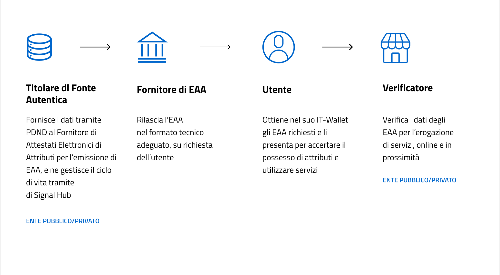
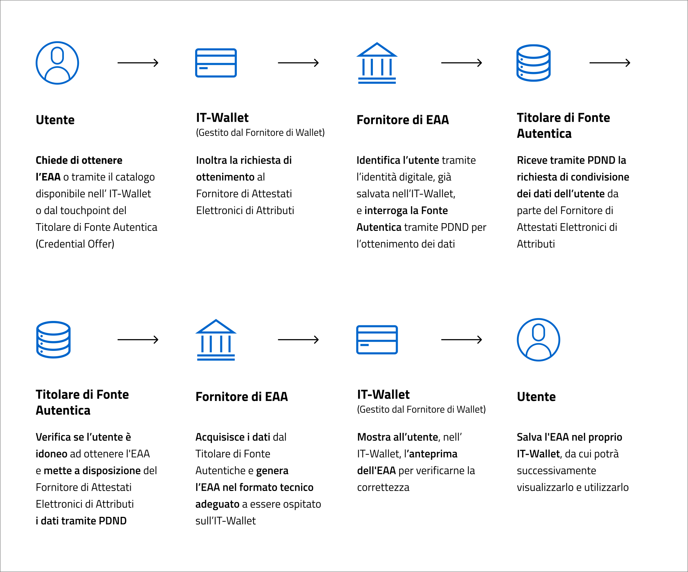

# Manuale operativo Titolare di Fonte Autentica IT-Wallet

### Guida operativa per la messa a disposizione dei dati per l'emissione di Attestati Elettronici di Attributi sulle soluzioni IT-Wallet (include Casi d'uso e Assistenza)

> **Nota introduttiva** — Il presente documento non ridefinisce quanto già definito all'interno delle Specifiche Tecniche. Qualora dovessero emergere interpretazioni diverse tra il manuale e le Specifiche Tecniche, il testo di queste ultime rappresenta la fonte normativa alla quale gli Enti devono attenersi.

## Indice dei contenuti

- [Introduzione e contesto](#Introduzione-e-contesto)
- [Scopo e ambito di applicazione](#Scopo-e-ambito-di-applicazione)
- [Ruoli e responsabilità del Titolare di Fonte Autentica](#Ruoli-e-responsabilità-del-Titolare-di-Fonte-Autentica)
- [Come diventare Titolare di Fonte Autentica](#Come-diventare-Titolare-di-Fonte-Autentica)
  - [Step 1 | Progettazione caratteristiche EAA](#step-1--progettazione-caratteristiche-eaa) 
  - [Step 2 | Pubblicazione in collaudo](#step-2--pubblicazione-in-collaudo) 
  - [Step 3 | Test in collaudo](#step-3--test-in-collaudo)
  - [Step 4 | Pubblicazione in produzione](#step-4--pubblicazione-in-produzione) 
  - [Step 5 | Test in produzione](#step-5--test-in-produzione)
  - [Step 6 | Pianificazione rilascio EAA](#step-6--pianificazione-rilascio-eaa)
  - [Step 7 | Manutenzione e assistenza](#step-7--manutenzione-e-assistenza)
- [File da compilare](#file-da-compilare)
- [Appendice A – Casi d'uso](#appendice-a--casi-duso)
- [Appendice B – Data Model](#appendice-b--data-model)
- [Appendice C – Mappatura errori](#appendice-c--mappatura-errori)
- [Appendice D – Mappatura stati](#appendice-d--mappatura-stati)
- [Appendice E – Assistenza](#appendice-e--assistenza)

## Introduzione e contesto

Il presente manuale rappresenta una **guida per gli Enti pubblici e privati che sono interessati a svolgere il ruolo di Titolari di Fonte Autentica nel Sistema IT-Wallet** e a **esporre dati per l'emissione di Attestati Elettronici di Attributi (Electronic Attestation of Attributes - EAA) nelle soluzioni IT-Wallet**.


Il Sistema di portafoglio digitale italiano (Sistema IT-Wallet) è stato istituito con la pubblicazione del decreto-legge 2 marzo 2024, n. 19 convertito, con modificazioni, dalla L. 29 aprile 2024, n. 56 ed in particolare, con l'art. 20, comma 1, lettera e), che ha introdotto l'[art. 64-quater del Codice dell'Amministrazione Digitale (CAD)](https://www.normattiva.it/eli/id/2005/05/16/005G0104/CONSOLIDATED/20250429). 

La novità normativa si inquadra nella più ampia iniziativa europea introdotta dal [Regolamento (UE) 2024/1183 del Parlamento europeo e del Consiglio dell'11 aprile 2024](http://data.europa.eu/eli/reg/2024/1183/oj) – c.d. eIDAS 2 – che modifica il [Regolamento (UE) n. 910/2014](https://eur-lex.europa.eu/eli/reg/2014/910/oj) per quanto riguarda l'istituzione del quadro europeo relativo all'identità digitale.  

Per la piena attuazione del Sistema IT-Wallet, all'articolo istitutivo del CAD seguono due decreti attuativi, di cui uno di adozione delle Linee Guida proposte da AgID, che vengono completate dalle Specifiche tecniche. La versione di riferimento delle Specifiche è quella mantenuta nel branch **Long-Term Support (LTS)** come descritto nel relativo [README](https://github.com/italia/eid-wallet-it-docs) all'interno della sezione [Branching Approach](https://github.com/italia/eid-wallet-it-docs?tab=readme-ov-file#branching-approach). La versione corrente delle Specifiche è disponibile a [questo link](https://italia.github.io/eid-wallet-it-docs/versione-corrente/it/) ([versione inglese](https://italia.github.io/eid-wallet-it-docs/versione-corrente/en/)).  

## Scopo e ambito di applicazione

Questo manuale, che sovrascrive e supera i manuali in formato .pdf precedentemente condivisi, ha lo scopo di: 

- supportare gli Enti nella definizione di tutti gli aspetti che contribuiscono a rendere possibile l’emissione, la fruizione e la manutenzione dell’EAA da parte dei soggetti interessati; 
- fornire indicazioni sul processo di implementazione e pubblicazione dell'**e-service PDND** per la messa a disposizione dei dati al Fornitore di Attestati Elettronici; 
- fornire riferimenti, risorse e strumenti pratici a supporto delle azioni richieste agli Enti nel corso di tale processo; 
- facilitare l'aderenza alle Specifiche Tecniche e alla normativa vigente.

Il presente manuale è da intendersi anche come uno strumento aperto alla condivisione e alla collaborazione tra gli Enti interessati. 

## Ruoli e responsabilità del Titolare di Fonte Autentica

Il Titolare di Fonte Autentica (Authentic Source - AS) è il soggetto che, nel Sistema IT-Wallet, detiene i dati da cui vengono creati gli Attestati Elettronici di Attributi rilasciati nelle soluzioni IT-Wallet. Ad esempio, per la Patente di Guida il Titolare di Fonte Autentica è la Direzione Generale di Motorizzazione del Ministero delle Infrastrutture e dei Trasporti. 

L'Ente che fornisce i dati, in quanto Titolare di Fonte Autentica, è l'unico soggetto che può definire mezzi e finalità di uso degli stessi. L'Ente rimarrà sempre il "proprietario" del dato e sarà responsabile del ciclo di vita del dato quindi di eventuali modifiche o cambiamenti di stato. Il Sistema IT-Wallet è concepito in modo che l'Ente possa continuare a gestire il dato in modo autonomo e conforme alle proprie politiche e alle normative vigenti. 

Di seguito rappresentato il ruolo del Titolare di Fonte Autentica e delle altre entità nel Sistema IT-Wallet. 



*Figura 1: Ruolo del Titolare di Fonte Autentica nel Sistema IT-Wallet*

Di seguito il ruolo del Titolare di Fonte Autentica nel contesto del flusso di richiesta ed emissione di un EAA. 



*Figura 2: Flusso di richiesta ed emissione di un EAA nel Sistema IT-Wallet* 

> **NB:** Nel Sistema IT-Wallet, coerentemente con la normativa, IPZS (Istituto Poligrafico e Zecca dello Stato) è l'unico Fornitore di Attestati Elettronici di Attributi di Interesse Pubblico e PagoPA S.p.A. è l'unico fornitore di soluzione pubblica di IT-Wallet, ospitata all'interno dell'app IO, l'app dei servizi pubblici.

## Come diventare Titolare di Fonte Autentica

Per rivestire il ruolo di Titolare di Fonte Autentica, ciascun Ente interessato deve attenersi al seguente processo di onboarding tecnico, da considerarsi valido fino alla pubblicazione del Regolamento IT-Wallet e alla disponibilità di:

- Portale di Onboarding
- Registro delle Fonti Autentiche
- Catalogo degli Attestati Elettronici

In particolare, il processo prevede i seguenti step: 

- **Step 1 | Progettazione caratteristiche EAA**: l'Ente approfondisce le Specifiche Tecniche del Sistema IT-Wallet e definisce le caratteristiche del Attestato Elettronico di Attributi relativo al proprio dataset, in relazione alle modalità di scoperta e ottenimento dell’EAA, i casi d’uso, il data model e le modalità di gestione di errori e stati. 
  [Vai allo Step 1](#step-1--progettazione-caratteristiche-eaa)
- **Step 2 | Pubblicazione in collaudo**: l'Ente effettua l'onboarding nella Piattaforma Digitale Nazionale Dati (PDND), se non lo ha già fatto, rilascia l'e-service in ambiente di collaudo su PDND, e attiva il relativo servizio Signal Hub in ambiente di collaudo per la gestione del ciclo di vita dell’EAA nel tempo. Infine, l'Ente notifica al Fornitore di Attestati Elettronici di Attributi, configurato come fruitore dell'e-service, l'avvenuta pubblicazione. 
  [Vai allo Step 2](#step-2--pubblicazione-in-collaudo)
- **Step 3 | Test in collaudo**: l'Ente, in ambiente di collaudo PDND, può eseguire i test di integrazione dell'e-service e di Signal Hub con il Fornitore di Attestati Elettronici di Attributi indicato come fruitore e, se ritenuto necessario, con il Fornitore di Wallet, anche gli aspetti relativi alla UX/UI dell’EAA. 
  [Vai allo Step 3](#step-3--test-in-collaudo)
- **Step 4 | Pubblicazione in produzione**: l'Ente rilascia l'e-service in ambiente di produzione su PDND e attiva il relativo servizio Signal Hub in produzione, al fine di supportare una corretta gestione del ciclo di vita dell’EAA. Infine, l'Ente notifica al Fornitore di Attestati Elettronici di Attributi l'avvenuta pubblicazione.
  [Vai allo Step 4](#step-4--pubblicazione-in-produzione)
- **Step 5 | Test in produzione**: l'Ente, in ambiente di produzione, esegue i test di integrazione, di carico e long run dell'e-service con il Fornitore di Attestati Elettronici di Attributi e, ove possibile se richiesto, con il Fornitore di Wallet per testare anche gli aspetti relativi alla UX/UI.
  [Vai allo Step 5](#step-5--test-in-produzione)
- **Step 6 | Pianificazione rilascio EAA**: a valle del buon esito dei test in collaudo e in produzione, l'Ente concorda con il Fornitore di Attestati Elettronici di Attributi, e se possibile con il Fornitore di Wallet, la data di rilascio, per l'ottenimento dell’EAA da parte degli utenti. Inoltre, l’Ente può valutare attività di comunicazione, in sinergia con gli altri attori interessati.
  [Vai allo Step 6](#step-6--pianificazione-rilascio-eaa)
- **Step 7 | Manutenzione e assistenza**: l'Ente effettua attività di gestione e manutenzione dell'e-service e contribuisce alla risoluzione di problematiche e segnalazioni, per le tematiche e i processi di competenza, secondo il modello di assistenza del Sistema IT-Wallet. 
  [Vai allo Step 7](#step-7--manutenzione-e-assistenza)

## Step 1 | Progettazione caratteristiche EAA

Questo step ha l'obiettivo di definire l'esperienza utente di scoperta, ottenimento, utilizzo e gestione dell’Attestato Elettronico di Attributi relativo al dataset rilasciato dalla Fonte Autentica. Le attività previste in questa fase riguardano l'Ente nei limiti delle proprie responsabilità, contribuendo all'esperienza utente e più in generale alla qualità del servizio finale (es. modalità di discovery, casi d'uso, qualità dei dati, assistenza, condizioni di validità dell'EAA). In questo step, l'Ente interessato deve: 


### **Approfondire le Specifiche Tecniche del Sistema IT-Wallet**

La versione corrente delle Specifiche Tecniche è disponibile a [questo link](https://italia.github.io/eid-wallet-it-docs/versione-corrente/it/). Si raccomanda l'approfondimento, in particolare, delle sezioni: 

- [Design dell'Esperienza Utente](https://italia.github.io/eid-wallet-it-docs/versione-corrente/it/functionalities.html) 
- [Fonti Autentiche](https://italia.github.io/eid-wallet-it-docs/versione-corrente/it/authentic-sources.html)  
- [Endpoint delle Fonti Autentiche](https://italia.github.io/eid-wallet-it-docs/versione-corrente/it/authentic-source-endpoint.html) 
- [Algoritmi Crittografici](https://italia.github.io/eid-wallet-it-docs/versione-corrente/it/algorithms.html) 
- [e-Service PDND](https://italia.github.io/eid-wallet-it-docs/versione-corrente/it/e-service-pdnd.html) 
- [Soluzione del Fornitore di Attestati Elettronici](https://italia.github.io/eid-wallet-it-docs/versione-corrente/it/credential-issuer-solution.html)
- [Gestione degli Attestati Elettronici](https://italia.github.io/eid-wallet-it-docs/versione-corrente/it/digital-credential-management.html)

### **Definire come l'utente può ottenere l'EAA**

Il Sistema IT-Wallet consente agli utenti di ottenere gli EAA attraverso diverse modalità. In particolare: 

- l'utente può avviare il flusso di ottenimento dell'EAA: 
  - **attraverso una sezione "catalogo" della soluzione IT-Wallet**, soluzione indicata per EAA di interesse nazionale o rivolti a un'ampia percentuale di popolazione (es. Tessera Sanitaria, Patente di guida, etc.). Per approfondimenti vai alle Specifiche Tecniche:
    - [Ottenimento dal Catalogo dell'Istanza del Wallet](https://italia.github.io/eid-wallet-it-docs/versione-corrente/it/functionalities.html#ottenimento-dal-catalogo-dell-istanza-del-wallet)
    - [Issuance Flow](https://italia.github.io/eid-wallet-it-docs/versione-corrente/it/credential-issuance-low-level.html#issuance-flow)
  - **attraverso uno dei touchpoint della Fonte Autentica** (es. sito web), soluzione indicata per EAA di interesse locale o rivolti a un pubblico specifico (es. certificati, prenotazioni, etc.). La Fonte Autentica può così **guidare l'utente** verso l'ottenimento dell'EAA tramite Credential Offer. Questo flusso può affiancarsi o sostituire il precedente a seconda del tipo di EAA. Per approfondimento vai alle Specifiche Tecniche:
    - [Ottenimento dal Touchpoint del Titolare della Fonte Autentica](https://italia.github.io/eid-wallet-it-docs/versione-corrente/it/functionalities.html#ottenimento-dal-touchpoint-della-fonte-autentica)
    - [Credential Offer](https://italia.github.io/eid-wallet-it-docs/versione-corrente/it/credential-issuance-low-level.html#flusso-credential-offer)
- il Titolare di Fonte Autentica può rispondere alla richiesta di emissione (tramite e-service) in: 
  - **modalità sincrona**, che consente l'ottenimento immediato dell'EAA da parte dell'utente e si configura come l'opzione preferibile;
  - **modalità differita**, che consente all'utente di ottenere l'EAA non contestualmente al momento della richiesta e si configura come l'opzione non preferibile.

È necessario quindi che l'Ente definisca a monte le modalità di ottenimento dell‘EAA reso disponibile grazie ai propri dati, sulla base di determinati parametri: a chi si rivolge l'EAA (a tutta la popolazione o solo a una nicchia di persone?); cosa deve fare l'utente per ottenere l'EAA (è necessario essere in possesso di specifici prerequisiti? deve effettuare un processo di richiesta/adesione/pagamento? etc.); tramite quali canali l'utente potrà richiedere l'EAA e quando potrà ottenerlo (contestualmente o non contestualmente alla richiesta). 

### **Definire i casi di utilizzo dell'EAA**

Il Sistema IT-Wallet consente agli utenti di utilizzare gli EAA in diverse modalità:

- **da remoto** (online), tramite flussi **cross-device**, cioè utilizzando due diversi device, tramite l'inquadramento di un QR code esposto dal Verificatore su loro property (es. sito) o in flussi **same-device**, cioè utilizzando solo lo smartphone, tramite appositi bottoni dedicati esposti dal Verificatore su loro property (es. sito o app). Per approfondimenti vai alle Specifiche Tecniche:
  - [Presentazione da remoto](https://italia.github.io/eid-wallet-it-docs/versione-corrente/it/functionalities.html#presentazione-da-remoto)
  - [Flusso remoto](https://italia.github.io/eid-wallet-it-docs/versione-corrente/it/remote-flow.html)
- **in prossimità** (in presenza), tramite flussi **supervisionati**, ovvero mostrando un QR code che il Verificatore potrà verificare tramite apposita app di verifica o **non supervisionati**, ovvero tramite strumenti di verifica automatica (tornelli, totem, etc.) con l'utilizzo di tecnologie sicure come il Bluetooth o NFC. Per approfondimenti vai alle Specifiche Tecniche:
  - [Presentazione in prossimità](https://italia.github.io/eid-wallet-it-docs/versione-corrente/it/functionalities.html#presentazione-in-prossimita)
  - [Flusso di prossimità](https://italia.github.io/eid-wallet-it-docs/versione-corrente/it/proximity-flow.html)

La definizione dei casi d'uso da parte dell'Ente è fondamentale per: 

- **progettare un'esperienza d'uso che apporti valore reale** sia a cittadini che ai verificatori; è utile definire a monte quali potranno essere le occasioni d'uso dell'EAA prodotto con i propri dati, a partire dall'analisi dell'esperienza attuale di fruizione del corrispettivo documento fisico, se esistente (es. si pensi alla modalità di presentazione del codice a barre per l'uso della Tessera Sanitaria o del QR code per la verifica della Carta Europea della Disabilità); 
- **orientare il tipo di formato** con cui il Fornitore di Attestati Elettronici emetterà l'EAA (SD-JWT-VC per scenari in remoto e mdoc-CBOR per scenari in prossimità).

A tal fine, l’Ente deve compilare la sezione `casi_d_uso` del file [Progettazione caratteristiche EAA](progettazione-caratteristiche-eaa.json). Per riferimenti e istruzioni di compilazione vedi [Appendice A](#appendice-a--casi-duso).

### **Definire il Data Model**

Il Sistema IT-Wallet consente all’utente di ottenere in formato digitale i propri documenti, titoli e certificati sotto forma di EAA. Gli EAA sono rilasciati dal Fornitore di Attestati Elettronici di Attributi sulla base dei dati forniti dalla Fonte Autentica tramite l'e-service.
L’Ente deve quindi definire quali dati fornirà e in quale ordine, affinché l'EAA prodotto risulti adeguato all'utilizzo da parte dell’utente. 

A tal fine, l’Ente deve compilare la sezione `e_service.response.data_model ` del file [Progettazione caratteristiche EAA](progettazione-caratteristiche-eaa.json) così da definire i dettagli sui dati che verranno messi a disposizione (es. tipologia, obbligatorietà, formato, lunghezza massima consentita, ordinamento, etc.). Per riferimenti e istruzioni di compilazione vedi [Appendice B](#appendice-b--data-model).

In conclusione, un'adeguata definizione del Data Model pone le basi per una corretta implementazione dell'e-service da pubblicare su PDND (vedi [Step 2](#step-2--pubblicazione-in-collaudo)) ma è altresì importante considerare e rispettare i seguenti requisiti tecnici: 

- **Identificativo utente**: Qualora fosse necessario identificare l'utente, il Codice Fiscale (CF) rappresenta l'identificativo univoco da utilizzare per le chiamate all'e-service; 
- **Completezza base di dati**: Ogni e-service pubblicato su PDND dovrà esporre un set di dati completo nel contenuto e negli attributi. È ammessa la pubblicazione di basi dati parziali relative a periodi temporali limitati.

### **Definire le casistiche di errore**

L'e-service messo a disposizione dall'Ente deve prevedere e gestire specifiche situazioni di errore che possono verificarsi nella fase di recupero dei dati da parte del Fornitore di Attestati di Attributi.

A tal fine, l'Ente deve compilare la sezione `e_service.response.mappatura_errori `del file [Progettazione caratteristiche EAA](progettazione-caratteristiche-eaa.json). La mappatura descrive le risposte che il servizio messo a disposizione dovrà obbligatoriamente gestire, consentendo comunque l'aggiunta di eventuali errori specifici, per garantire una corretta informazione all'utente in caso di errori durante l'ottenimento dell'EAA. Per riferimenti e istruzioni di compilazione vedi [Appendice C](#appendice-c--mappatura-errori).
### **Definire la gestione degli stati del ciclo di vita**

Il Sistema IT-Wallet supporta dei meccanismi per l’aggiornamento dello stato e la gestione del ciclo di vita dell’EAA. Gli stati che l'Ente comunica tramite Signal Hub determinano il ciclo di vita degli EAA prodotti dai propri dati.  
Si precisa che, pur essendo strettamente correlato, **il ciclo di vita dell'EAA non è completamente sovrapponibile a quello della versione fisica del documento**. In particolare: 

- Se il documento fisico viene invalidato dal Titolare di Fonte Autentica, l'EAA viene anch'essa invalidata;  
- Se l'EAA viene invalidato o rimosso dal portafoglio da parte dell'utente, questo non si ripercuote sul corrispettivo eventuale documento fisico.  Per ragioni di sicurezza, l'EAA ha in generale una **durata massima di un anno** (vedi sotto approfondimento su scadenza tecnica), ma in casi d'uso specifici tale durata potrebbe essere ulteriormente ridotta e solo in casi specifici questo ha ricadute sulla validità del corrispettivo documento fisico (come, ad esempio, per attestati che vengono utilizzati una sola volta ad esempio biglietti del treno, cinema, ecc). Trascorso l'anno, l'utente dovrà richiedere nuovamente l'EAA.

Gli stati ammissibili per un Attestato Elettronico di Attributi sono i seguenti: 

- **Valido**: EAA emesso, nessun segnale di modifica su uno dei suoi attributi o sul suo stato, entro la data di scadenza. L'utente può utilizzarlo in ogni scenario d'uso;
- **Sospeso**: EAA temporaneamente non valido, in uno stato di reversibilità. L'utente deve aspettare che lo stato torni ad essere valido (es. Patente ritirata);
- **Non Valido**: EAA non più valido, in uno stato di irreversibilità. L'utente può solo eliminarlo e/o richiedere l'emissione di nuovo EAA che sovrascriva il precedente (es. Patente annullata).

Oltre agli stati sopra elencati, è bene specificare che lo stato di un Attestato Elettronico può essere influenzato anche dalla **scadenza amministrativa** e/o dalla **scadenza tecnica**. Rispettivamente l'EAA può, quindi, assumere anche i seguenti stati: 

- **Scaduto**: EAA con data di scadenza amministrativa superata. La scadenza amministrativa può essere definita dal Titolare di Fonte Autentica e, se ritenuta utile o necessaria, deve essere inclusa come attributo all'interno del data model dell'EAA per garantire messaggi informativi all'interno della soluzione IT-Wallet (es. La tua Patente scade tra 30 giorni);
- **Da aggiornare**: EAA con data di scadenza tecnica superata. La scadenza tecnica è definita del Fornitore di Attestati Elettronici di Attributi ed è impostata generalmente a 1 anno o comunque a un valore inferiore o uguale alla data di scadenza amministrativa. Tale scadenza ha l'obiettivo di richiedere un'azione di riemissione esplicita all'utente e mitigare rischi di sicurezza.

**Corrispondenza con l'API Fonte Autentica (OpenAPI).** Nel file [Progettazione caratteristiche EAA](progettazione-caratteristiche-eaa.json), l'array `e_service.response.stati` ammette per il campo `stato` esattamente questi valori testuali: **Valido**, **Non Valido**, **Sospeso** e **Scaduto**. Nei contratti OpenAPI dell'e-service Fonte Autentica (es. `OAS3-PDND-AS.yaml`), il campo `status` di ciascun dataset in `attributeClaims` è invece limitato a **`VALID`**, **`INVALID`** e **`SUSPENDED`**: le scadenze si desumono dai metadati e dai claim (`expiry_date`, `last_updated`, `exp`/`nbf`, ecc.) e, lato specifica, i casi *Issued* ed *Expired* rientrano in `VALID` se non sussistono revoca o sospensione. Indicazione operativa: **Non Valido** corrisponde a `INVALID`; **Sospeso** a `SUSPENDED`; **Valido** a `VALID`; **Scaduto** descrive nello Strumento di progettazione la casistica percepita dall'utente quando l'EAA non è più utilizzabile per scadenza, mentre sul canale OpenAPI il dataset resta caratterizzato da uno dei tre `status` precedenti (di norma `VALID` con scadenza nei metadati, oppure `INVALID` se l'Ente imposta la cessazione — inclusa la scadenza amministrativa senza metadato idoneo — come da Specifiche Tecniche).

Per approfondimenti vai alle Specifiche Tecniche, sezione [Ciclo di Vita degli Attestati Elettronici](https://italia.github.io/eid-wallet-it-docs/versione-corrente/it/credential-revocation.html). 

A tal fine, l'Ente deve compilare la sezione `e_service.response.stati` del file [Progettazione caratteristiche EAA](progettazione-caratteristiche-eaa.json) per definire i messaggi e l'applicabilità dei quattro valori **Valido**, **Non Valido**, **Sospeso** e **Scaduto**.

Per riferimenti e istruzioni di compilazione vedi [Appendice D](#appendice-d--mappatura-stati).

**Nota**: 
Per ottimizzare l'esperienza d'uso dell'IT-Wallet pubblico, il Titolare di Fonte Autentica può anche valutare l'**integrazione con app IO per l'invio di messaggi informativi al cittadino**, quali ad esempio:

- comunicare il cambio di stato del documento (come, ad esempio, un reminder sulla scadenza)
- informarlo che il nuovo documento è pronto per essere ritirato
- novità legate ai servizi offerti (opzionale ma consigliato).

### **Definire i contenuti per l'informazione e l'assistenza all'utente**

L'Ente deve contribuire al [modello di assistenza](https://italia.github.io/eid-wallet-it-docs/versione-corrente/it/functionalities.html#assistenza-utente) del Sistema IT-Wallet rendendo disponibili contenuti utili alla predisposizione di nuove Domande Frequenti e/o testi informativi in app, e fornendo i recapiti necessari per la gestione dell'assistenza agli utenti.  
A tal fine, l'Ente deve compilare la sezione `assistenza` del file [Progettazione caratteristiche EAA](progettazione-caratteristiche-eaa.json). Per riferimenti e istruzioni di compilazione vedi [Appendice E](#appendice-e--assistenza).

### **Predisporre gli elementi necessari per la rappresentazione grafica dell'EAA**

Il Sistema IT-Wallet consente ai Titolari di Fonte Autentica di contribuire alla resa grafica degli EAA prodotti a partire dai propri dati. La rappresentazione visiva di un EAA all’interno di un IT-Wallet può dipendere quindi, per specifici aspetti, da parametri definiti nelle Specifiche Tecniche, sezione [Focus sugli Attestati Elettronici di Attributi](https://italia.github.io/eid-wallet-it-docs/versione-corrente/it/functionalities.html#focus-sugli-attestati-elettronici-di-attributi). 
L'Ente interessato a personalizzare la resa grafica dell'EAA prodotto dai propri dati deve trasmettere i propri materiali come documentazione allegata all'e-service su PDND (vedi [Step 2](#step-2--pubblicazione-in-collaudo)).
### **Validare il file “progettazione_EAA”**

A conclusione delle azioni sopra elencate, l’Ente deve validare il file ”progettazione_EAA" in tutte le sue parti (sezioni `casi_d_uso`, `data_model`, `mappatura_errori`, `e_service.response.stati` e `assistenza`) utilizzando lo strumento indicato nel file ”validazione_progettazione_caratteristiche_EAA”. 

Per poter proseguire con gli step successivi, è infatti obbligatorio eseguire validazione JSON Schema e controllo sintattico. Per i comandi e il workflow, vedi [Validazione JSON Schema e Linter](validazione-json-schema-linter.md). La checklist prevede: 

- validazione JSON Schema superata; 
- JSON Linter senza errori; 
- tutti i campi obbligatori (risposta) compilati per la sezione scelta; 
- file rinominato correttamente.
## Step 2 | Pubblicazione in collaudo

Questo step ha l'obiettivo di rilasciare in collaudo su PDND l'e-service che espone i dati per la produzione degli EAA e di attivare il relativo servizio Signal Hub per la gestione dei dati nel tempo. Inoltre, l'Ente può rilasciare in collaudo il Credential Offer se ritenuto utile durate lo [Step 1](#step-1--progettazione-caratteristiche-eaa)).

Per i dettagli implementativi, consultare le Specifiche Tecniche, in particolare:

- [e-Service PDND](https://italia.github.io/eid-wallet-it-docs/versione-corrente/it/e-service-pdnd.html)
- [Endpoint delle Fonti Autentiche](https://italia.github.io/eid-wallet-it-docs/versione-corrente/it/authentic-source-endpoint.html)
- [Signal Hub](https://italia.github.io/eid-wallet-it-docs/versione-corrente/it/signal-hub-endpoint.html)
In questo step, l'Ente interessato deve: 
### **Aderire alla Piattaforma Digitale Nazionale Dati (PDND)**

Per effettuare l'onboarding alla PDND, qualora l'Ente ancora non abbia aderito, consultare il [Manuale Operativo PDND Interoperabilità](https://docs.pagopa.it/interoperabilita-1/manuale-operativo/guida-alladesione). 

### **Pubblicare l'e-service su PDND in collaudo**

L'Ente deve sviluppare e rilasciare in collaudo un e-service coerente con il Data Model precedentemente definito, in linea con le informazioni presenti nel [Manuale Operativo PDND Interoperabilità](https://docs.pagopa.it/interoperabilita-1/manuale-operativo/guida-alladesione) e con le Specifiche Tecniche italiane. Per i dettagli operativi e le Specifiche Tecniche, consultare:

- [sezione e-service del Manuale Operativo PDND Interoperabilità](https://docs.pagopa.it/interoperabilita-1/manuale-operativo/e-service)
- [sezione Titolare di Fonte Autentica delle Specifiche Tecniche](https://italia.github.io/eid-wallet-it-docs/versione-corrente/it/authentic-sources.html)

Contestualmente al flusso di pubblicazione dell'e-service, l'Ente deve allegare, come documentazione aggiuntiva su PDND, il file [Progettazione caratteristiche EAA](progettazione-caratteristiche-eaa.json) precedentemente compilato in tutte le sue parti e e validato (sezioni `casi_d_uso`, `data_model`, `mappatura_errori`, `e_service.response.stati` e `assistenza`). 

Nel caso di EAA di interesse pubblico, l'Ente deve aggiungere l'attributo certificato Istituto Poligrafico e Zecca dello Stato S.P.A. all'e-service erogato, se possibile impostando l'accettazione automatica delle richieste di fruizione.

Si consiglia di nominare l'e-service in "Creazione EAA [Nome / Nome tipologia EAA] – IT-Wallet" (es. "Creazione EAA Patente di guida – IT-Wallet" oppure "Creazione EAA Titoli di studio – IT-Wallet") e di predisporre una descrizione in linea con le Linee Guida sull’infrastruttura tecnologica della PDND per l’interoperabilità dei sistemi informativi e delle basi di dati ([Allegato 7 - Regole di popolamento](https://italia.github.io/pdnd-guida-nomenclatura-eservice/index.html)) emanate da AgID. 

### **Attivare il servizio Signal Hub in collaudo**

L'Ente deve attivare in collaudo il servizio [Signal Hub](https://developer.pagopa.it/pdnd-interoperabilita/guides/manuale-operativo-pdnd-interoperabilita/v1.0/riferimenti-tecnici/signal-hub) di PDND per il relativo e-service, in coerenza con quanto definito dalle [Specifiche Tecniche](https://italia.github.io/eid-wallet-it-docs/versione-corrente/it/signal-hub-endpoint.html) per la gestione degli stati, precedentemente mappati nella sezione `e_service.response.stati` del file [Progettazione caratteristiche EAA](progettazione-caratteristiche-eaa.json).  

### **Sviluppare il Credential Offer (opzionale)**

L'Ente, se ritenuto necessario e/o utile per ingaggiare l'utente nel flusso di ottenimento dell'EAA, deve provvedere in questo step agli sviluppi e all'integrazione del Credential Offer all'interno delle proprie soluzioni.  

### **Notificare l'avvenuto rilascio in collaudo**

L'Ente deve notificare il Fornitore di Attestati di Attributi circa l'avvenuto rilascio dell'e-service in collaudo su PDND, dei servizi di Signal Hub in collaudo e, se previsto, del Credential Offer. In caso di EAA di interesse pubblico, l'Ente deve notificare IPZS inviando una mail all'indirizzo identitadigitale@pec.ipzs.it.

## Step 3 | Test in collaudo

Questo step, suggerito ma non vincolante per le fasi successive, ha l'obiettivo di eseguire i test propedeutici al rilascio in produzione. 

Per i dettagli implementativi, consultare le Specifiche Tecniche, in particolare:

- [Endpoint delle Fonti Autentiche](https://italia.github.io/eid-wallet-it-docs/versione-corrente/it/authentic-source-endpoint.html)
- [Signal Hub](https://italia.github.io/eid-wallet-it-docs/versione-corrente/it/signal-hub-endpoint.html)
In questo step, in caso di disponibilità da parte del Fornitore di Attestati Elettronici di Attributi, l'Ente interessato può: 
### **Eseguire i test in collaudo**

L'Ente **può** testare in collaudo con il Fornitore di Attestati Elettronici di Attributi (e.g. IPZS, nel caso di Attestati Elettronici di interesse pubblico):

- la corretta erogazione dei dati tramite l'e-service in PDND
- la corretta fruizione del servizio Signal Hub di PDND per la gestione del ciclo di vita dell'EAA
- se previsto, il Credential Offer

Infine, se ritenuto necessario, l'Ente può verificare la resa grafica dell'EAA di interesse con il Fornitore di Wallet (e.g. PagoPA, nel caso di soluzione pubblica di IT-Wallet).

Una volta superati i test in collaudo, se eseguiti, l'Ente può proseguire con la fase successiva.

## Step 4 | Pubblicazione in produzione

Questo step ha l'obiettivo di rilasciare in produzione l'e-service che espone i dati per la produzione degli EAA e di attivare il relativo servizio Signal Hub per la gestione dei dati nel tempo. Inoltre, l'Ente può rilasciare in produzione il Credential Offer se ritenuto utile per guidare gli utenti all'ottenimento degli EAA prodotti con i propri dati. 

Per i dettagli implementativi, consultare le Specifiche Tecniche, in particolare:

- [e-Service PDND](https://italia.github.io/eid-wallet-it-docs/versione-corrente/it/e-service-pdnd.html)
- [Signal Hub](https://italia.github.io/eid-wallet-it-docs/versione-corrente/it/signal-hub-endpoint.html)
In questo step, l'Ente interessato deve:
### **Pubblicare l'e-service su PDND in produzione**

L'Ente deve rilasciare l'e-service su PDND in produzione. Nel caso di EAA di interesse pubblico, l'Ente deve abilitare IPZS alla fruizione del servizio, se possibile con abilitazione automatica. 

### **Attivare il servizio Signal Hub in produzione**

L'Ente deve attivare in produzione il servizio Signal Hub di PDND per il relativo e-service, in coerenza con quanto definito dalle [Specifiche Tecniche](https://italia.github.io/eid-wallet-it-docs/versione-corrente/it/signal-hub-endpoint.html) per la gestione degli stati, precedentemente mappati nella sezione `e_service.response.stati` del file [Progettazione caratteristiche EAA](progettazione-caratteristiche-eaa.json).  

### **Portare in produzione il Credential Offer (opzionale)**

L'Ente, se precedentemente sviluppato in collaudo, deve provvedere in questo step al rilascio in produzione del Credential Offer all'interno delle proprie soluzioni.  

### **Notificare l'avvenuto rilascio in produzione**

L'Ente deve notificare il Fornitore di Attestati di Attributi circa l'avvenuto rilascio dell'e-service in produzione su PDND, dei servizi di Signal Hub in produzione e, se previsto, del Credential Offer. In caso di EAA di interesse pubblico, l'Ente deve notificare IPZS inviando una mail all'indirizzo identitadigitale@pec.ipzs.it e, in caso di EAA disponibile nella soluzione pubblica di IT-Wallet, l'Ente deve notificare PagoPA inviando una mail all'indirizzo XX.

## Step 5 | Test in produzione

Questo step ha l'obiettivo di eseguire i test necessari a un adeguato funzionamento di quanto rilasciato in produzione. 

Per i dettagli implementativi, consultare le Specifiche Tecniche, in particolare:

- [Endpoint delle Fonti Autentiche](https://italia.github.io/eid-wallet-it-docs/versione-corrente/it/authentic-source-endpoint.html)
In questo step, l'Ente interessato deve:
### **Effettuare i test in produzione**

L'Ente deve eseguire i test di tutte le componenti sviluppate (si consiglia un mese prima del go-live). In particolare:

- **Test di carico**: 300 richieste al secondo per almeno 60 minuti, con tempi di risposta inferiori a 500 millisecondi
- **Test di long run**: 150 richieste al secondo per almeno 12 ore consecutive, con tempi di risposta inferiori a 500 millisecondi

Una volta superati i test in produzione, l'Ente può proseguire con la fase successiva. 

## Step 6 | Pianificazione rilascio EAA

Questo step ha l'obiettivo di pianificare e gestire le attività di rilascio agli utenti degli EAA prodotti con i propri dati. 

Per i dettagli implementativi, consultare le Specifiche Tecniche, in particolare:

- [Brand Identity](https://italia.github.io/eid-wallet-it-docs/versione-corrente/it/brand-identity.html)
In questo step, l'Ente interessato deve:
### **Pianificare il go-live**

A valle del buon esito dei test in collaudo e in produzione, l'Ente concorda con il Fornitore di Attestati Elettronici di Attributi e il Fornitore di Wallet la data di rilascio dell'EAA, quindi la possibilità di ottenimento dell'EAA da parte degli utenti. L'Ente dovrà in ogni caso effettuare la registrazione amministrativa, non appena disponibile, secondo quanto definito dal Regolamento IT-Wallet.

### **Valutare attività di comunicazione**

L'Ente può prevedere attività di comunicazione finalizzate a informare gli utenti della possibilità di ottenere e utilizzare l'EAA prodotto con i propri dati all'interno di IT-Wallet. Per approfondimento, vai alle Specifiche Tecniche, sezione [Brand Identity](https://italia.github.io/eid-wallet-it-docs/versione-corrente/it/brand-identity.html) del Sistema IT-Wallet. 

## Step 7 | Manutenzione e assistenza

Una volta resi disponibili agli utenti gli EAA prodotti con i propri dati, la Fonte Autentica deve mantenere l'e-service e un ruolo attivo sia nella gestione dei dati (e del conseguente ciclo di vita degli EAA) che nell'assistenza agli utenti. 

Per i dettagli implementativi, consultare le Specifiche Tecniche, in particolare:

- [Assistenza utente](https://italia.github.io/eid-wallet-it-docs/versione-corrente/it/functionalities.html#assistenza-utente)
In questo step, l'Ente interessato deve:
### **Garantire la gestione e manutenzione dell'e-service**

L'Ente deve garantire il corretto funzionamento dell'e-service nel tempo, programmare adeguate azioni di monitoraggio e aggiornamento se richieste, ad esempio, da cambiamenti normativi o procedurali (es. nuovi dati, stati, casistiche di errore, etc.).

È altresì importante che l’ente mantenga il proprio e-service aggiornato all’ultima versione indicata dalle Linee Guida IT-Wallet, facendo riferimento al branch LTS e assicurandosi in particolare di implementare sempre l’ultima versione di patch disponibile.

### **Gestire problematiche e fornire assistenza agli utenti**

L'Ente deve garantire un costante aggiornamento delle informazioni riportate delle informazioni riportate nella sezione `assistenza` del file [Progettazione caratteristiche EAA](progettazione-caratteristiche-eaa.json) al fine di:

- **Contribuire alla risoluzione di bug** 
Il referente dell'ambito sistemistico e il referente dell'ambito applicativo, così come definito nella sezione `assistenza.referenti` del template, devono contribuire alla diagnosi congiunta delle segnalazioni ricevute da Fornitore di Attestati Elettronici di Attributi (IPZS, nel caso di EAA di interesse pubblico) e Fornitori di Wallet (PagoPA, nel caso della soluzione pubblica IT-Wallet) e relativa risoluzione, secondo quanto definito dal [modello di assistenza](https://italia.github.io/eid-wallet-it-docs/versione-corrente/it/functionalities.html#assistenza-utente) del Sistema IT-Wallet. 
- **Garantire il supporto agli utenti** 
Il referente per l'ambito assistenza ed almeno un canale di contatto dedicato agli utenti finali (es. indirizzo e-mail, numero telefonico, etc.), così come definito nella sezione `assistenza` del file [Progettazione caratteristiche EAA](progettazione-caratteristiche-eaa.json), devono sempre essere disponibili per gestire eventuali problemi relativi all'EAA, come ad esempio la segnalazione di dati errati o di errori nella fase di ottenimento dell'EAA da parte dell'utente.

## File da compilare


Per assolvere a quanto previsto dallo Step 1, l‘Ente deve: 
- scaricare il file JSON [Progettazione caratteristiche EAA](progettazione-caratteristiche-eaa.json)
- duplicare il file JSON per ciascuna EAA di interesse e rinomina ciascun file in "progettazione_ caratteristiche_eaa_[Nome Ente Titolare]_[Nome EAA]" (es. "progettazione_eaa_mim_titolo_di_studio.json"). 
- compilare ciascun file JSON in tutte le sue parti al fine di definire a monte tutte le caratteristiche che assumerà l’Attestato Elettronico emesso dal Fornitore di Attestati Elettronici di Attributi a livello di dati esposti, casi d'uso, assistenza, mappatura errori e stati.  
- validare ciascun il file JSON compilato utilizzando lo strumento indicato nel [file di validazione](https://github.com/italia/eid-wallet-it-docs/pull/1063/changes#diff-2337c8d8533155cad677214d3d5b723d77fa1f18fe26b99df6e9f6c91b4da9f5).

A compilazione e validazione conclusa, l’Ente può procedere con la sottomissione del file secondo quanto descritto nello [Step 2](#step-2--pubblicazione-in-collaudo), ricordando di mantenere sempre aggiornate le informazioni di questa sezione secondo le modalità definite nello [Step 7](#step-7--manutenzione-e-assistenza).

Il file JSON [Progettazione caratteristiche EAA](progettazione-caratteristiche-eaa.json) contiene le seguenti sezioni: 

- Casi d’uso (istruzioni di compilazione in [Appendice A](#appendix-a)) 
- Data Model (istruzioni di compilazione in [Appendice B](#appendix-b)) 
- Mappatura errori (istruzioni di compilazione in [Appendice C](#appendix-c)) 
- Mappatura stati (istruzioni di compilazione in [Appendice D](#appendix-d)) 
- Assistenza (istruzioni di compilazione in [Appendice E](#appendix-e)) 


## Appendice A – Casi d'uso EAA

Questa appendice descrive le istruzioni di compilazione della sezione `casi_d_uso` del file JSON [Progettazione caratteristiche EAA](progettazione-caratteristiche-eaa.json). Assicurati di aver letto quanto riportato nella sezione [File da compilare](#file-da-compilare) prima di proseguire.

### Obiettivo

L’obiettivo della sezione `casi_d_uso` è quello di supportare gli Enti nella definizione dei casi d'uso e delle modalità di utilizzo degli EAA di cui intendono fornire i dati, a partire dall'analisi delle attuali modalità di utilizzo dei corrispettivi documenti, ove esistenti. 


### Istruzioni di compilazione 

1. **metadata**: inserisci `nome_ente_titolare`, `nome_eaa` e `data_compilazione` (formato ISO: `AAAA-MM-GG`);
2. **campi opzionali** e **campi obbligatori**: nel caso l'EAA si riferisce a un documento fisico o digitale già esistente (es. patente) compila sia i campi obbligatori che i campi opzionali (`volume_rilascio`, `canali_richiesta`, `formato_attuale,` `pagamento`, ecc.). Nel caso invece l'EAA non abbia un documento preesistente corrispondente, compila solo i campi obbligatori e lascia vuoti i campi opzionali;
3. **risposta**: compila il campo `risposta` rispondendo in maniera chiara ed esaustiva ad ogni domanda; il campo `suggerimento` è solo indicativo.

**Esempio di compilazione** (fragmento):

```json
{
  "metadata": {
    "nome_ente_titolare": "Ministero dell'Istruzione",
    "nome_eaa": "Titolo di studio",
    "data_compilazione": "2026-03-16",
    "versione": "1.0"
  },
  "casi_d_uso": {
    "target_utenti": {
      "chi_puo_richiedere": {
        "domanda": "Chi può ad oggi richiedere il documento? ...",
        "suggerimento": "Solo maggiorenni residenti in una specifica regione",
        "risposta": "Tutti i cittadini italiani in possesso di diploma rilasciato da istituto italiano"
      }
    }
  }
}
```

---
## Appendice B – Data Model

Questa appendice descrive le istruzioni di compilazione della sezione `data_model` del file JSON [Progettazione caratteristiche EAA](progettazione-caratteristiche-eaa.json). Assicurati di aver letto quanto riportato nella sezione [File da compilare](#file-da-compilare) prima di proseguire. 

**Obiettivo**

L’obiettivo della sezione `data_model `è quello di supportare gli Enti nella definizione delle caratteristiche dell'e-service - e quindi del corrispettivo Attestato Elettronico di Attributi (EAA) - in termini di dati resi disponibili al suo interno. 

**Istruzioni di compilazione**

1. Prima di iniziare la compilazione, consulta i [Template PDND Data Model](#Template-eservice-PDND) e usali come punto di partenza per il tuo e-service così da assicurare un'elevata aderenza e compliance alle Specifiche Tecniche. 
2. Associa a ciascun dato che si intende rende disponibile all’interno dell’EAA un "nome campo" tra quelli definiti nella "Lista nome campo" sottostante o, se necessario, creane uno nuovo assicurandoti che sia parlante e che descriva adeguatamente il dato. 
3. Ordina i campi in modo da facilitare la leggibilità: inserisci per primi i dati anagrafici (nome, cognome, data di nascita, luogo di nascita, codice fiscale), poi i dati specifici dell'attestato.

```json
"e_service": {
  "response": {
    "data_model": [
      {
        "attestazione": "ISEE",
        "parametro": "tax_code",
        "descrizione": "codice fiscale dell'utente",
        "nome_campo": "Codice Fiscale",
        "esempio_campo_compilato": "DLNRSL88L51C348G",
        "obbligatorio": "SI",
        "tipologia": "ALFANUMERICO",
        "lunghezza_massima_caratteri": "16",
        "note": ""
      }
    ]
  }
}
```

*Tabella 1 – Struttura Data Model (sezione `e_service.response.data_model`)*

```json
"e_service": {
  "lista_nome_campo": [
    {
      "categoria": "Dati anagrafici e di identità",
      "parametro": "",
      "nome_campo": "Nome",
      "descrizione": ""
    },
    {
      "categoria": "Dati anagrafici e di identità",
      "parametro": "",
      "nome_campo": "Cognome",
      "descrizione": ""
    },
    {
      "categoria": "Dati anagrafici e di identità",
      "parametro": "",
      "nome_campo": "Codice Fiscale",
      "descrizione": ""
    },
    {
      "categoria": "Residenza e domicilio",
      "parametro": "",
      "nome_campo": "Comune di residenza",
      "descrizione": ""
    },
    {
      "categoria": "Istruzione e formazione",
      "parametro": "",
      "nome_campo": "Qualifica",
      "descrizione": ""
    },
    {
      "categoria": "Patenti e veicoli",
      "parametro": "",
      "nome_campo": "Data di rilascio",
      "descrizione": ""
    },
    {
      "categoria": "Patenti e veicoli",
      "parametro": "",
      "nome_campo": "Scadenza",
      "descrizione": ""
    },
    {
      "categoria": "Generali",
      "parametro": "",
      "nome_campo": "Origine dei dati",
      "descrizione": ""
    }
  ]
}
```

*Tabella 2 – Lista nome campo (sezione `e_service.lista_nome_campo`)*

## Appendice C – Mappatura errori

Questa appendice descrive le istruzioni di compilazione della sezione `mappatura_errori` del file JSON [Progettazione caratteristiche EAA](progettazione-caratteristiche-eaa.json). Assicurati di aver letto quanto riportato nella sezione [File da compilare](#file-da-compilare) prima di proseguire. 

**Obiettivo**

L’obiettivo della sezione `mappatura_errori` è quello di supportare gli Enti nella definizione delle caratteristiche dell'e-service - e quindi del corrispettivo Attestato Elettronico di Attributi (EAA) - in termini di errori che potrebbero occorrere interagendo con l'e-service corrispondente.

**Istruzioni di compilazione**

1. Per il codice 200 e per tutti gli errori obbligatori (400, 401, 404, 429, 500, 503) definisci la motivazione che ha scatenato l'errore e popola il campo "Causa"(es. Servizio momentaneamente non disponibile);
2. Per ciascun errore descrivi l'azione necessaria per risolvere il problema nel campo "Azione utente". (es. Ti invitiamo a riprovare più tardi). Usa il campo "Note" per aggiungere ulteriori informazioni utili o una spiegazione del perché proponiamo all'utente di compiere un'azione specifica;
3. Se ritenuto utile, compila allo stesso modo gli errori non obbligatori (es. 540 e 541) e/o aggiungi eventuali ulteriori errori specifici.

Nel caso di compilazione degli errori opzionali:
- Per l'errore 540 (EAA non esistente presso l'Authentic Source), utilizza il formato "state": "description", es.: "NOT_EXISTING": "l'EAA non è presente presso l'Authentic Source", "PENDING": "l'EAA è in attesa di emissione". 
- Per l'errore 541 (EAA in stato non valido o sospeso), descrivi la causa secondo le [Specifiche Tecniche](https://italia.github.io/eid-wallet-it-docs/versione-corrente/en/OAS3-PDND-Issuer.html#tag/e-services-PDND/operation/notifyStatusCredentials) (es. scaduto, sospeso, revocato, annullato). 

```json
"e_service": {
  "response": {
    "mappatura_errori": [
      {
        "codice": "200",
        "esito": "Attestato digitale valido",
        "applicabile": "SI",
        "causa": "Vengono ritornati correttamente i dati, nessuna risposta di errore. Qualora non ci fossero azioni utente da eseguire, riportare stringa vuota.",
        "azione_utente": "",
        "note": ""
      },
      {
        "codice": "404",
        "esito": "Not found",
        "applicabile": "SI",
        "causa": "Non sono stati trovati documenti di titolarità dell'utente",
        "azione_utente": "Chiudere e riprovare successivamente",
        "messaggio": "Ti invitiamo ad ottenere il documento presso l'Ente titolare prima di richiedere la sua versione digitale"
        "note": "L'utente deve prima acquisire la titolarità del documento per ottenerne la versione digitale"
      },
      {
        "codice": "540",
        "esito": "EAA non esistente presso l'Authentic Source",
        "applicabile": "",
        "causa": "",
        "azione_utente": "",
        "note": ""
      },
      {
        "codice": "541",
        "esito": "EAA in stato non valido o sospeso",
        "applicabile": "",
        "causa": "",
        "azione_utente": "",
        "note": ""
      }
    ]
  }
}
```

*Tabella 3 – Mappatura Errori (sezione `e_service.response.mappatura_errori`)*

## Appendice D – Mappatura stati

Questa appendice descrive le istruzioni di compilazione della sezione `e_service.response.stati` del file JSON [Progettazione caratteristiche EAA](progettazione-caratteristiche-eaa.json). Assicurati di aver letto quanto riportato nella sezione [File da compilare](#file-da-compilare) prima di proseguire. 

**Obiettivo**

L’obiettivo della sezione `e_service.response.stati `è quello di supportare gli Enti nella definizione delle caratteristiche dell'e-service - e quindi del corrispettivo Attestato Elettronico di Attributi (EAA) - in termini di stati che potrebbero caratterizzare l’EAA nel corso del suo ciclo di vita.

**Valori ammessi per `stato` e uso in OpenAPI.** Nel JSON di progettazione il campo `stato` di ogni elemento dell'array può assumere solo: **Valido**, **Non Valido**, **Sospeso**, **Scaduto** (come da schema di validazione). Sul canale tecnico, il campo `status` dei dataset nell'OpenAPI Fonte Autentica (`OAS3-PDND-AS.yaml`) resta limitato a **VALID**, **INVALID**, **SUSPENDED**; per la correlazione con i metadati di scadenza vedi il paragrafo *Corrispondenza con l'API Fonte Autentica* in [Step 1 | Progettazione caratteristiche EAA](#step-1--progettazione-caratteristiche-eaa).

**Istruzioni di compilazione**

1. Mappa la condizione di applicabilità di ciascuno stato relativamente all'attestato in analisi. 
2. Descrivi l'azione necessaria per ripristinare lo stato di validità all’interno del campo "Azione utente" (es. Chiedere la riemissione del documento presso uffici fisici / in digitale).  
3. Definisci il messaggio da condividere con l'utente (es. I tuoi dati sono stati aggiornati nella banca dati ANIS, scarica la nuova versione digitale del documento). Usa il campo "Note" per aggiungere ulteriori informazioni utili o una spiegazione del perché proponiamo all'utente di compiere un'azione specifica. 
4. Per approfondimenti: [Ciclo di Vita degli Attestati Elettronici](https://italia.github.io/eid-wallet-it-docs/versione-corrente/it/credential-revocation.html).

```json
"e_service": {
  "response": {
    "stati": [
      {
        "stato": "Valido",
        "descrizione": "L'EAA è valido e può essere utilizzato",
        "applicabile": "SI",
        "azione_utente": "",
        "messaggio": "",
        "note": ""
      },
      {
        "stato": "Non Valido",
        "descrizione": "L'EAA non è più valido e dunque non può essere più utilizzato",
        "applicabile": "",
        "azione_utente": "L'utente deve scaricare nuovamente l'EAA in app",
        "messaggio": "",
        "note": ""
      },
      {
        "stato": "Sospeso",
        "descrizione": "L'EAA è sospeso e non può essere temporaneamente utilizzato",
        "applicabile": "",
        "azione_utente": "",
        "messaggio": "",
        "note": ""
      },
      {
        "stato": "Scaduto",
        "descrizione": "L'EAA è scaduto e necessita una riemissione",
        "applicabile": "",
        "azione_utente": "",
        "messaggio": "",
        "note": ""
      }
    ]
  }
}
```

*Tabella 4 – Mappatura stati (sezione `e_service.response.stati`)*

## Appendice E – Assistenza

Questa appendice descrive le istruzioni di compilazione della sezione `assistenza` del file JSON [Progettazione caratteristiche EAA](progettazione-caratteristiche-eaa.json). Assicurati di aver letto quanto riportato nella sezione [File da compilare](#file-da-compilare) prima di proseguire. 

**Obiettivo** 

L’obiettivo della sezione `assistenza` è quello di supportare gli Enti nella definizione dei contenuti per l'informazione e il supporto all'utente nell’interazione con l'EAA.  

Nello specifico, l'Ente deve contribuire al [modello di assistenza](https://italia.github.io/eid-wallet-it-docs/versione-corrente/it/functionalities.html#assistenza-utente) del Sistema IT-Wallet rendendo disponibili i recapiti necessari per la risoluzione di eventuali malfunzionamenti, i canali disponibili per la gestione dell'assistenza agli utenti e i contenuti utili alla predisposizione di nuove Domande Frequenti e/o testi informativi da esporre all’utente in IT-Wallet. 

**Istruzioni di compilazione** 

- Referenti: fornisci e mantieni aggiornati, i dati di contatto (nome, cognome, email, telefono) di almeno 1 referente per l’assistenza agli utenti, 1 referente in ambito applicativo e 1 referente in ambito sistemistico che possano prontamente collaborare con il Fornitore di Attestati Elettronici di Attributi (IPZS per gli Attestati Elettronici di interesse pubblico) e con il Fornitore di Wallet (PagoPA per la soluzione IT-Wallet pubblica) per la risoluzione congiunta di segnalazioni degli utenti e/o malfunzionamenti tra i servizi. 
- Canali: fornisci almeno un canale di assistenza (es. e-mail assistenza, numero di telefono, etc.) di responsabilità dell’Ente che rappresenti, nel ruolo di Titolare di Fonte Autentica, a cui si possa indirizzare l’utente per quelle richieste di supporto e segnalazioni non gestibili all’interno della soluzione IT-Wallet.  
- FAQ: contribuisci alla definizione dei contenuti utili a predisporre le domande più frequenti e comuni relative all’EAA in analisi, dall’emissione all’utilizzo fino alla gestione del suo ciclo vita. 
- testi_informativi (opzionale): se ritenuto utile o necessario dal Titolare di Fonte Autentica, approfondisci la casistica all’interno delle [Specifiche Tecniche](https://italia.github.io/eid-wallet-it-docs/versione-corrente/it/functionalities.html#ottenimento-dal-catalogo-dell-istanza-del-wallet)); se ritenuto utile, definisci le informazioni essenziali da esporre agli utenti nella soluzione IT-Wallet prima di avviare l’ottenimento dell’EAA e sintetizzale in un testo adeguato. In particolare: 
1) Poniti le seguenti domande (puoi fare riferimento alla sezione “casi_d_uso”, già compilato):  A chi si rivolge o a chi è dedicato l’EAA? (es. pensionati, studenti, etc.) Sussistono dei limiti, delle restrizioni o dei prerequisiti per poter ottenere l’EAA? (es. aver ottenuto la versione fisica del documento, aver conseguito la titolarità al documento dopo il 2020, etc.) Dove e come è possibile usare l’EAA? 
2) Formula un testo informativo rivolto all’utente a partire dai contenuti sopra raccolti, assicurandoti che sia chiaro, semplice, diretto e conciso (circa 300 - 450 caratteri, spazi inclusi).
## Appendice B – Data Model

---


